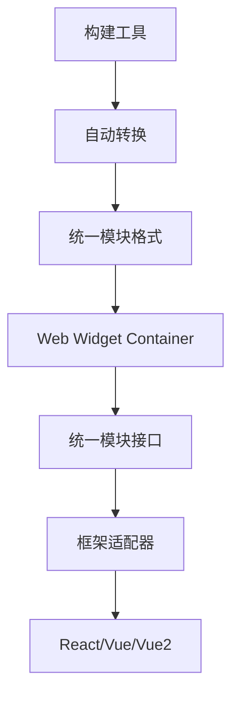

# Web Widget 架构文档

## 概述

Web Widget 是一个真正的"元框架"，能够渲染任何前端 UI 框架。本文档集合详细分析了其架构设计、实现原理和构建工具机制。

## 文档结构

### 1. [Web Widget 元框架架构分析](./web-widget-meta-framework.zh.md)

**核心内容**: 元框架的基础架构设计

- 统一的模块接口
- 框架适配器模式
- 生命周期管理
- 关键实现细节
- 实际应用示例

**适合读者**: 想要了解 Web Widget 核心架构的开发者

### 2. [构建工具自动转换机制](./build-tools-auto-transformation.zh.md)

**核心内容**: 构建工具的自动化机制

- Vite 插件架构
- Export Render Plugin
- Import Render Plugin
- 框架特定配置
- 构建时优化

**适合读者**: 想要了解构建工具如何实现自动化转换的开发者

## 阅读建议

### 入门顺序

1. **首先阅读** [Web Widget 元框架架构分析](./web-widget-meta-framework.zh.md)
   - 了解核心概念和架构设计
   - 理解框架适配器模式
   - 掌握生命周期管理机制

2. **然后阅读** [构建工具自动转换机制](./build-tools-auto-transformation.zh.md)
   - 了解构建工具如何实现自动化
   - 理解 Vite 插件的工作原理
   - 掌握配置和优化技巧

### 按需阅读

- **架构师/技术决策者**: 重点阅读架构分析文档
- **前端开发者**: 两个文档都需要了解
- **构建工具开发者**: 重点阅读构建工具文档
- **框架适配器开发者**: 两个文档都需要深入理解

## 核心概念速览

### 元框架设计

### 关键特性

- **框架无关性**: 通过标准接口抽象支持任何框架
- **自动转换**: 构建工具自动处理框架兼容性
- **统一生命周期**: 所有框架组件遵循相同的生命周期
- **类型安全**: 完整的 TypeScript 支持
- **零配置**: 开发者无需手动编写适配代码

## 相关包

本文档涉及以下核心包：

- **`@web-widget/web-widget`**: 核心容器和生命周期管理
- **`@web-widget/vite-plugin`**: 构建工具自动转换
- **`@web-widget/react`**: React 框架适配器
- **`@web-widget/vue`**: Vue 框架适配器
- **`@web-widget/vue2`**: Vue2 框架适配器
- **`@web-widget/schema`**: 类型定义和接口规范

## 快速开始

想要快速体验 Web Widget 的多框架支持，可以参考：

- [examples/react](../examples/react/): React 应用示例
- [examples/vue](../examples/vue/): Vue 应用示例
- [examples/vue2](../examples/vue2/): Vue2 应用示例
- [playgrounds/widget](../playgrounds/widget/): 多框架组件演示

## 贡献指南

如果你想要：

- **改进文档**: 请提交 Pull Request
- **报告问题**: 请在 GitHub 上创建 Issue
- **添加新框架支持**: 请参考现有适配器的实现模式
- **优化构建工具**: 请深入了解 Vite 插件机制

## 相关资源

- [项目主页](https://github.com/web-widget/web-widget)
- [API 文档](../api/)
- [迁移指南](../migration/)
- [性能优化](../performance/)
