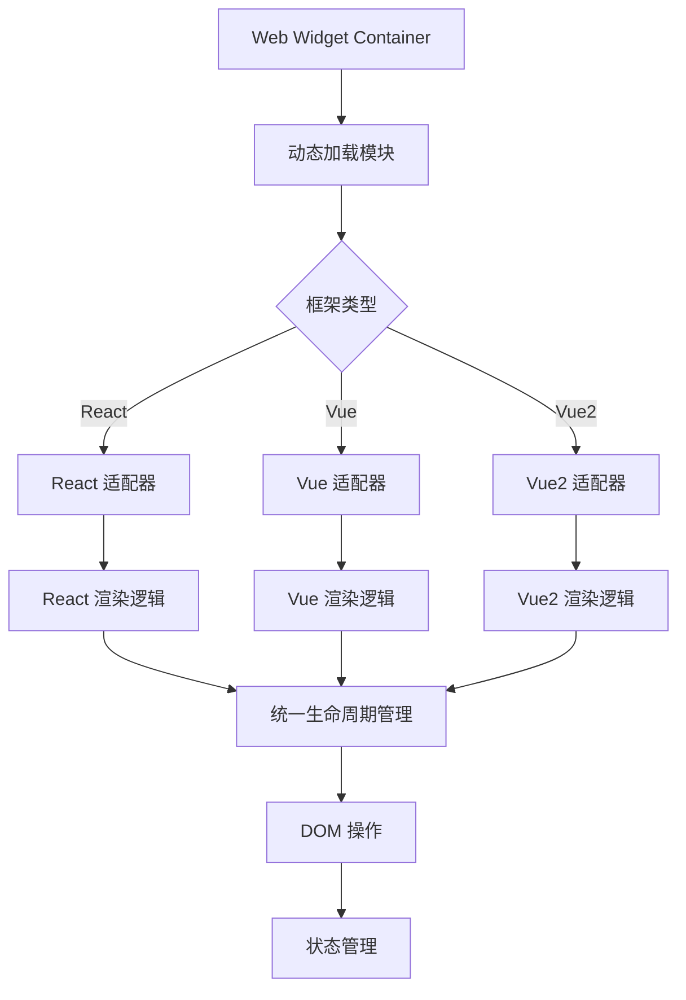

# Web Widget 元框架架构分析

## 概述

Web Widget 是一个真正的"元框架"，能够渲染任何前端 UI 框架（React、Vue、Vue2 等）。本文档详细分析了其架构设计和实现原理，包括核心架构、框架适配器模式、构建工具自动转换等关键机制。

## 核心架构

### 1. 统一的模块接口

Web Widget 定义了一套统一的模块接口，所有框架都需要实现这些接口：

```typescript
// 客户端模块接口
interface ClientWidgetModule {
  default?: unknown; // 组件
  meta?: Meta; // 元数据
  render?: ClientRender; // 渲染函数
}

// 服务端模块接口
interface ServerWidgetModule {
  default?: unknown; // 组件
  meta?: Meta; // 元数据
  render?: ServerRender; // 渲染函数
}
```

### 2. 标准化的渲染函数

框架需要实现标准的渲染函数签名：

```typescript
// 客户端渲染
interface ClientRender<Component, Data, Options> {
  (component: Component, data: Data, options: Options):
    void | Promise<ClientRenderResult<Data>>;
}

// 服务端渲染
interface ServerRender<Component, Data, Options> {
  (component: Component, data: Data, options: Options):
    string | ReadableStream<string> | Promise<...>;
}
```

### 3. 生命周期管理

Web Widget 容器管理完整的组件生命周期，包括以下状态：

- `initial` → `loading` → `loaded`
- `bootstrapping` → `bootstrapped`
- `mounting` → `mounted`
- `updating` → `mounted`
- `unmounting` → `loaded`
- `unloading` → `initial`

每个状态都有对应的错误状态（如 `load-error`、`mount-error` 等）。

## 框架适配器模式

### React 适配器 (`@web-widget/react`)

```typescript
// packages/react/src/client.ts
export const render = defineClientRender<FunctionComponent>(
  async (component, data, { recovering, container }) => {
    // React 特定的渲染逻辑
    if (recovering) {
      root = hydrateRoot(container, vNode); // 水合
    } else {
      root = createRoot(container); // 客户端渲染
      root.render(vNode);
    }

    return {
      mount() {
        /* React 挂载逻辑 */
      },
      unmount() {
        /* React 卸载逻辑 */
      },
    };
  }
);
```

### Vue 适配器 (`@web-widget/vue`)

```typescript
// packages/vue/src/client.ts
export const render = defineClientRender<Component>(
  async (component, data, { recovering, container }) => {
    // Vue 特定的渲染逻辑
    app = recovering
      ? createSSRApp(WidgetSuspense, data) // 水合
      : createApp(WidgetSuspense, data); // 客户端渲染

    return {
      mount() {
        app.mount(container);
      },
      unmount() {
        app.unmount();
      },
    };
  }
);
```

## 工作流程



## 关键实现细节

### 1. 动态模块加载

Web Widget 容器通过动态导入加载框架模块：

```typescript
// packages/web-widget/src/container.ts
async load() {
  const mod = await this.#moduleLoader();
  if (!mod?.render || typeof mod.render !== 'function') {
    throw new Error('Invalid module: missing render() function.');
  }
  this.#module = mod;
}
```

### 2. 渲染目标抽象

支持不同的渲染目标：

```typescript
type RenderTarget = 'light' | 'shadow'; // Light DOM 或 Shadow DOM
```

### 3. 状态转换管理

严格的状态转换规则确保生命周期的一致性：

```typescript
const statusTransitions: Record<Status, Status[]> = {
  [INITIAL]: [LOADING],
  [LOADING]: [LOADED, LOAD_ERROR],
  [LOADED]: [BOOTSTRAPPING, UNLOADING],
  [BOOTSTRAPPING]: [BOOTSTRAPPED, BOOTSTRAP_ERROR],
  [BOOTSTRAPPED]: [MOUNTING, UNLOADING],
  [MOUNTING]: [MOUNTED, MOUNT_ERROR],
  [MOUNTED]: [UPDATING, UNMOUNTING],
  [UPDATING]: [MOUNTED, UPDATE_ERROR],
  [UNMOUNTING]: [LOADED, UNMOUNT_ERROR],
  [UNLOADING]: [INITIAL, UNLOAD_ERROR],
  // ... 错误状态转换
};
```

## 实际应用示例

### React 组件示例

```tsx
// examples/react/routes/examples/(components)/Counter@widget.tsx
import { useState, useRef } from 'react';
import styles from './Counter.module.css';

export default function Counter({ count: initialCount }: CounterProps) {
  const [count, setCount] = useState(initialCount);

  return (
    <div className={styles.counter}>
      <button onClick={() => setCount(count - 1)}>−</button>
      <span>{count}</span>
      <button onClick={() => setCount(count + 1)}>+</button>
    </div>
  );
}
```

### 在页面中使用

```tsx
// examples/react/routes/examples/index@route.tsx
import ReactCounter from './(components)/Counter@widget.tsx';

export default function Page() {
  return (
    <div>
      <h1>Web Widget Demo</h1>
      <ReactCounter count={0} />
    </div>
  );
}
```

## 关键优势

### 1. 框架无关性

- 通过标准接口抽象，任何框架只需实现适配器
- 无需关心框架间的兼容性问题

### 2. 统一生命周期

- 所有框架组件都遵循相同的生命周期管理
- 一致的错误处理和状态管理

### 3. 渲染模式支持

- 同时支持服务端渲染（SSR）和客户端渲染（CSR）
- 支持渐进式渲染和流式渲染

### 4. 动态加载

- 运行时动态加载不同框架的组件
- 支持懒加载和按需加载策略

### 5. 类型安全

- 完整的 TypeScript 类型定义
- 编译时类型检查确保正确性

## 总结

Web Widget 通过精心设计的架构实现了真正的框架无关性：

1. **标准化接口**: 统一的模块和渲染接口
2. **适配器模式**: 每个框架通过适配器实现标准接口
3. **生命周期管理**: 统一的状态管理和错误处理
4. **动态加载**: 运行时加载不同框架的组件
5. **类型安全**: 完整的 TypeScript 支持

这种设计使得 Web Widget 能够在同一个应用中无缝集成 React、Vue、Vue2 等不同框架的组件，开发者只需要关注业务逻辑，无需关心框架间的兼容性问题。
