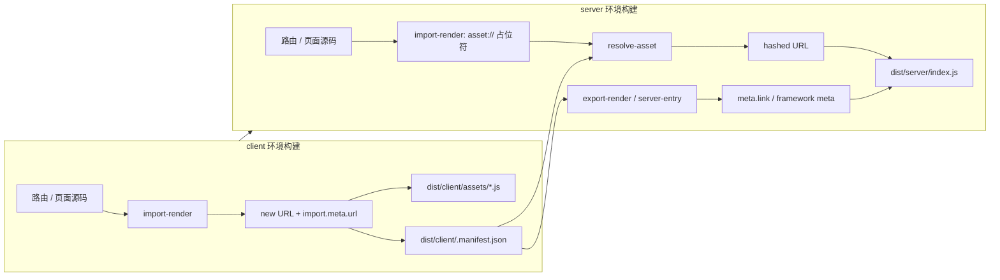
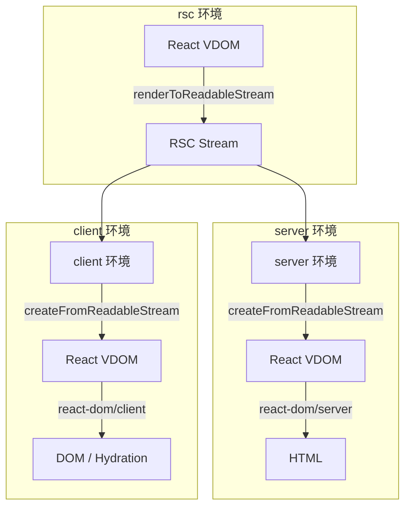

# Widget Module 双环境构建与元框架对比

本文档说明 Web Widget Module 在 Vite 8 Environment API 下的 client → manifest → server 构建流程，并与 [vite-plugin-react](https://github.com/vitejs/vite-plugin-react) 生态及其它元框架的 client/server 组件模型做对比。

相关文档：[Vite 8 迁移与构建改进说明](./vite8-migration-build.zh.md)

---

## 1. Widget Module 是什么

`@web-widget/schema` 定义了技术无关的模块格式。其中 Widget Module 与 React 的 Client Component 在职责上类似：可在服务端渲染外壳，在客户端加载实现并完成水合。

```typescript
// Server Widget Module
interface ServerWidgetModule {
  default?: unknown;
  meta?: Meta; // HTML head：link、script、style 等
  render?: ServerRender;
}

// Client Widget Module
interface ClientWidgetModule {
  default?: unknown;
  meta?: Meta;
  render?: ClientRender;
}
```

同一份 widget 源码在 **client** 与 **server** 两个 Vite 环境中会被编译成不同语义：client 产出真实 chunk，server 只保留对 client 资产的间接引用。Vite 内部 server 环境 key 仍为 `ssr`（见 [Vite 8 迁移说明](./vite8-migration-build.zh.md#术语)）。

---

## 2. Web Widget 的构建流程

### 2.1 总体顺序

`vite build` 时，`@web-widget/vite-plugin` 通过 Vite 8 `builder.buildApp` 在同一进程内顺序执行：

```
builder.build(client)   →  产出 hashed chunks + .manifest.json
        ↓
builder.build(server)      →  读 manifest，解析占位符，注入 meta
```

对应实现见 `runRouterBuildApp`（`src/plugins/entry-assets-plugin.ts`）。

| 命令               | 行为                                                           |
| ------------------ | -------------------------------------------------------------- |
| `vite build`       | client → server 双构建                                         |
| `vite build --ssr` | 仅 server 构建（需已有 client manifest；CLI 标志名为 `--ssr`） |

### 2.2 client 环境：产出真实资产

`import-render` 插件在 client 构建时，将路由/页面中的 widget 引用改写为 `defineWebWidget` 容器，并通过 Rolldown 原生的 `new URL(specifier, import.meta.url).href` 解析带 hash 的 chunk URL（与动态 `import()` 共享同一模块图，无需 `emitFile`）。

```javascript
// 构建后（client）示意
const MyWidget = defineWebWidget(() => import('./widgets/foo@widget.vue'), {
  import: new URL('./widgets/foo@widget.vue', import.meta.url).href, // → /assets/foo-[hash].js
  name: 'MyWidget',
});
```

### 2.3 server 环境：占位符 + manifest 解析

server 构建第一阶段（同一 `import-render` transform，server 环境）写入 `asset://` 占位符：

```javascript
// server transform 中间态
const MyWidget = defineWebWidget(() => import('./widgets/foo@widget.vue'), {
  import: 'asset://widgets/foo@widget.vue',
  name: 'MyWidget',
});
```

server 构建第二阶段：`@web-widget:resolve-asset`（`applyToServerEnvironment`）在 `configResolved` 中通过 `getManifest()` 读取 `dist/client/.manifest.json`，将 `asset://` 替换为带 base 的 hashed URL。

`export-render` 与 `server-entry-plugin` 同样依赖 client manifest：

- export-render：为 server widget 追加 `meta.link`（CSS、modulepreload 等）
- server-entry-plugin：为框架入口注入 client entry 的 script / importmap / link

Dev 模式下不走磁盘 manifest，而是通过 `ServerDevEnvironment` 的模块图与 transform 管线推断 CSS（见 `dev/meta.ts`）。

### 2.4 流程图



---

## 3. 是否符合 Vite 8 Environment API？

符合，且是官方推荐的框架集成模式之一。

Vite 8 [Environment API](https://vite.dev/guide/api-environment) 与 [Frameworks 指南](https://vite.dev/guide/api-environment-frameworks) 明确：

- 每个环境（`client`、`server` 等）拥有独立的 `moduleGraph`、`pluginContainer`
- 生产构建通过 `ViteBuilder` 编排；`builder.build(client)` 后再 `builder.build(server)` 以传递资产清单，是常见模式
- 插件用 `applyToEnvironment` 限定 hook 作用范围，用 `sharedDuringBuild: true` 在双构建间共享状态

Web Widget 插件的对应关系：

| Vite 8 机制                              | Web Widget 用法                                             |
| ---------------------------------------- | ----------------------------------------------------------- |
| `builder.buildApp`                       | `runRouterBuildApp`：client → server                        |
| `configEnvironment`                      | 为 client/server 注入独立 `outDir`、`rolldownOptions.input` |
| `applyToEnvironment`                     | server entry、manifest 解析、`meta` 注入仅 server           |
| `RunnableDevEnvironment.runner.import()` | dev 每请求加载 server entry                                 |
| `sharedDuringBuild`                      | `RouterPluginHost` 经 `plugin.api` 跨插件共享               |

当前唯一偏「传统」之处：server 通过 `fs.readFile` 读取磁盘上的 client manifest（`getManifest`），而非内存传递。这在 Remix、SvelteKit 等框架中仍很常见；Vite 社区正在讨论将 manifest 挂到 `BuildEnvironment` 上，但尚未成为稳定 API。

---

## 4. 与 vite-plugin-react 生态对比

[vite-plugin-react](https://github.com/vitejs/vite-plugin-react) 是 Vite 官方 React 插件 monorepo，包含三个主要包：

| 包                                                                                                          | 职责                          | 与 Web Widget 的可比性                |
| ----------------------------------------------------------------------------------------------------------- | ----------------------------- | ------------------------------------- |
| [@vitejs/plugin-react](https://github.com/vitejs/vite-plugin-react/tree/main/packages/plugin-react)         | JSX、Fast Refresh、React 编译 | 不负责 client/server 边界，不直接可比 |
| [@vitejs/plugin-react-swc](https://github.com/vitejs/vite-plugin-react/tree/main/packages/plugin-react-swc) | 同上，使用 SWC                | 同上                                  |
| [@vitejs/plugin-rsc](https://github.com/vitejs/vite-plugin-react/tree/main/packages/plugin-rsc)             | React Server Components       | 高度可比（见下节）                    |

### 4.1 @vitejs/plugin-rsc：三环境模型

`@vitejs/plugin-rsc` 基于 Vite Environment API，定义 三个 生产环境（比 Web Widget 的 client + server 多一个 `rsc`）：

| 环境   | 条件 / 职责                                                                             |
| ------ | --------------------------------------------------------------------------------------- |
| rsc    | `react-server` 条件；`renderToReadableStream` 序列化 RSC payload；处理 Server Functions |
| server | 反序列化 RSC stream → React VDOM → `react-dom/server` 输出 HTML                         |
| client | 反序列化 RSC、hydration、客户端重取 RSC、`rsc:update` HMR                               |



边界由 React 生态约定标记：

- `"use client"` → Client Component，打进 client bundle
- `"use server"` → Server Function
- `server-only` / `client-only` → 构建期校验，防止错误跨环境导入

### 4.2 跨环境引用：plugin-rsc vs Web Widget

| 维度                    | @vitejs/plugin-rsc                                                      | @web-widget/vite-plugin                                           |
| ----------------------- | ----------------------------------------------------------------------- | ----------------------------------------------------------------- |
| 环境数量                | rsc + server + client（3）                                              | client + server（2）                                              |
| 边界标记                | `"use client"`、`server-only`                                           | `@widget` 后缀 + `defineWebWidget`                                |
| server 对 client 的引用 | Client Reference（RSC stream 内嵌引用 ID）                              | `asset://` 占位符 → client manifest 解析                          |
| 跨环境 Dev API          | `import.meta.viteRsc.loadModule` / `__VITE_ENVIRONMENT_RUNNER_IMPORT__` | `runner.import()` + 模块图 CSS 收集                               |
| 跨环境 Build            | 静态 import 重写 + `__vite_rsc_env_imports_manifest.js`                 | 读 `dist/client/.manifest.json`                                   |
| client 启动脚本         | `loadBootstrapScriptContent('index')`                                   | `server-entry-plugin` 注入 `meta.script`                          |
| CSS                     | `import.meta.viteRsc.loadCss()` 自动收集                                | `export-render` / `dev/meta` 从 manifest 或模块图生成 `meta.link` |
| 序列化协议              | RSC Flight stream（`react-server-dom`）                                 | HTML + `meta` + 标准 ESM chunk URL                                |
| 框架耦合                | 提供 RSC runtime，框架可自建路由                                        | 绑定 `@web-widget/web-router` + Widget Module schema              |

核心相似点：两种方案都让 server 侧不打包 client 运行时代码，只保留对 client 产物的间接引用；构建期都需要 client 先于（或至少不晚于）server 完成资产收集。

核心差异：

1. plugin-rsc 用 React 官方的 RSC 协议在运行时传递组件树；Web Widget 用 URL + meta 在 HTML 层描述要加载的 chunk。
2. plugin-rsc 显式拆出 `rsc` 环境处理 `react-server` 条件；Web Widget 在 server 环境内完成服务端渲染，无独立第三环境。
3. plugin-rsc 提供一等跨环境 API（`viteRsc.loadModule`）；Web Widget 在构建期用 transform 完成引用解析，dev 用 `ServerDevEnvironment` 抽象。

### 4.3 @vitejs/plugin-react（非 RSC）

`@vitejs/plugin-react` 仅处理 React 编译与 HMR，不定义 client/server 组件边界，也不编排双环境构建。全栈 server 渲染场景通常由：

- 框架插件（Remix、React Router RSC、`@vitejs/plugin-rsc`）或
- `@web-widget/vite-plugin`

负责环境与 manifest 流程。因此对比 Widget Module 双构建时，应主要看 plugin-rsc，而非基础 plugin-react。

---

## 5. 与其它元框架对比

### 5.1 双构建 + client manifest（与 Web Widget 最接近）

| 框架                    | 模型             | client/server 边界            | Manifest / 引用方式                                  |
| ----------------------- | ---------------- | ----------------------------- | ---------------------------------------------------- |
| Web Widget              | Widget Module    | `@widget` + `defineWebWidget` | client Vite manifest → `asset://` 解析 + `meta.link` |
| Remix / React Router v7 | Route Module     | loader/action + 同构组件      | Vite client manifest → server 注入 assets            |
| SvelteKit               | Svelte 组件      | `.server` / 自动 client 检测  | client manifest → `<script>` / `<link>`              |
| Nuxt 3                  | Vue 组件 + Nitro | 自动 server/client 拆分       | Vite client manifest → Nitro server 渲染             |
| SolidStart              | Solid 组件       | `server$` 等                  | Vite 双环境 + manifest                               |

共性：server 不内联 client bundle，通过 manifest 或等价清单解析 hashed URL。

### 5.2 Islands / 部分水合

| 框架  | 模型                 | 与 Widget Module 的相似点                  |
| ----- | -------------------- | ------------------------------------------ |
| Astro | Islands (`client:*`) | server 静态外壳 + 按需加载 client chunk    |
| Qwik  | Resumability (QRL)   | server 输出 symbol 引用，client 按清单恢复 |

### 5.3 RSC 系（含 plugin-rsc）

| 框架 / 插件        | 模型                    | 引用方式                               |
| ------------------ | ----------------------- | -------------------------------------- |
| Next.js App Router | RSC + Client Components | Flight + client module map             |
| @vitejs/plugin-rsc | 三环境 RSC              | Client Reference + env import manifest |
| Waku               | React RSC on Vite       | 多环境 + RSC 引用图                    |

---

## 6. 概念映射：Widget Module ≈ 轻量 Client Component

可将 Widget Module 理解为一种不依赖 React Flight 的 Client Component 边界：

```
Server Widget Module              Client Widget Module
├── default（服务端可用）           ├── default（组件实现）
├── render（server）              ├── render（hydrate）
└── meta ← client manifest        └── meta（dev：模块图推断）
```

| Concern           | React RSC (plugin-rsc)                   | Web Widget                       |
| ----------------- | ---------------------------------------- | -------------------------------- |
| 划界              | `"use client"`                           | `@widget` + `defineWebWidget`    |
| server 侧持有什么 | Client Reference ID                      | `asset://` → hashed URL          |
| 运行时协议        | RSC stream                               | ESM + importmap + `<web-widget>` |
| 资产清单          | `__vite_rsc_env_imports_manifest.js` 等  | `dist/client/.manifest.json`     |
| HTML 注入         | `loadBootstrapScriptContent` / `loadCss` | `meta.script` / `meta.link`      |

---

## 7. 可选演进方向

以下改进非必须，当前磁盘 manifest 流程已符合 Vite 8 实践：

1. 内存 manifest：client build 结束后写入 `RouterPluginHost`，server 优先读内存；待 Vite 提供 `environment.manifest` 后可进一步对齐。
2. Virtual module：例如 `virtual:web-widget-client-manifest`，仅在 server 环境 resolve，集中 manifest 读取逻辑。
3. Dev / Build 统一：dev 用模块图 key、build 用 manifest key（已有 `normalizeFilterId` / `toManifestFilterKey` 方向）。

---

## 8. 结论

| 问题                                         | 结论                                                                                                  |
| -------------------------------------------- | ----------------------------------------------------------------------------------------------------- |
| client → manifest → server 是否符合 Vite 8？ | 符合；`builder.buildApp` 顺序编排即为此设计                                                           |
| 与 React Client Component 的关系？           | 概念类似（server 引用、client 实现），机制不同（manifest + Widget Module vs Flight + `"use client"`） |
| vite-plugin-react 中谁最可比？               | @vitejs/plugin-rsc（三环境 RSC）；基础 plugin-react 不参与此层                                        |
| 其它元框架怎么做？                           | 多数 Vite 全栈框架为 client manifest → server；RSC 系用协议 + module map                              |

Web Widget 的双阶段构建是 Vite 8 Environment API 下的正确且常见的框架集成方式；与 [@vitejs/plugin-rsc](https://github.com/vitejs/vite-plugin-react/tree/main/packages/plugin-rsc) 同属「多环境 + 跨环境引用」家族，差异主要在边界标记、环境数量与运行时协议，而非构建哲学本身。

---

## 参考

- [Vite 8 Environment API](https://vite.dev/guide/api-environment)
- [Vite 8 Environment API for Frameworks](https://vite.dev/guide/api-environment-frameworks)
- [vite-plugin-react monorepo](https://github.com/vitejs/vite-plugin-react)
- [@vitejs/plugin-rsc README](https://github.com/vitejs/vite-plugin-react/tree/main/packages/plugin-rsc)
- [React Server Components](https://react.dev/reference/rsc/server-components)
- [@web-widget/schema — Widget Module](../../schema/README.md)
- [Vite 8 迁移与构建改进说明](./vite8-migration-build.zh.md)
