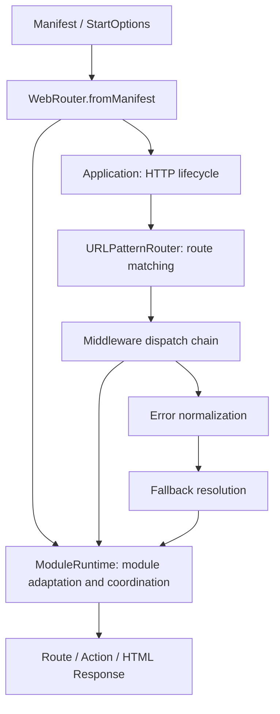
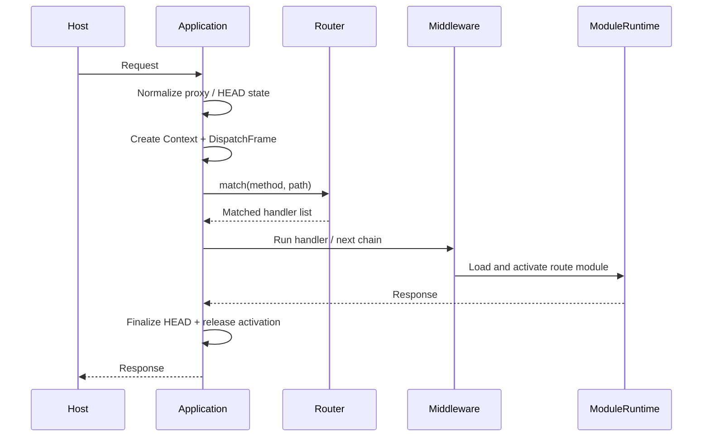
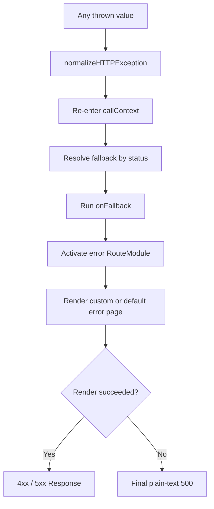

# Web Router Contributing Guide

This guide is for contributors changing the internals of `@web-widget/web-router`. It focuses on architectural boundaries, request flow, and verification. See [README.md](./README.md) for usage and [`@web-widget/schema`](../schema/README.md) for the module format.

## Quick Start

```bash
git clone https://github.com/web-widget/web-widget.git
cd web-widget
pnpm install
cd packages/web-router
```

Common commands:

```bash
pnpm test             # Run unit tests
pnpm run test:watch   # Watch mode
pnpm run test:coverage
pnpm run test:memory-leak
pnpm run lint
pnpm run build        # Build JavaScript and type declarations
```

Tests run with Vitest and `@cloudflare/vitest-pool-workers` to match the Cloudflare Workers runtime.

## Architecture Overview

Web Router has six major areas: assembly, HTTP dispatch, route matching, module runtime, rendering, and error handling.



### Module Responsibilities

| Module           | Responsibility                                                             |
| ---------------- | -------------------------------------------------------------------------- |
| `index.ts`       | Create and assemble a complete `WebRouter` from a manifest                 |
| `application.ts` | Request lifecycle, middleware dispatch, rewrite, HEAD, and error boundary  |
| `router/`        | Route registration and compiled URLPattern matching                        |
| `context.ts`     | Per-request state, lazy Request, rewrite, and `waitUntil`                  |
| `module/`        | Schema module loading, handler adaptation, route activation, and rendering |
| `error.ts`       | Error normalization, status selection, and fallback routing                |
| `layout.ts`      | Default page layout                                                        |
| `fallback.ts`    | Default error page                                                         |
| `types.ts`       | Schema type aggregation and router-specific types                          |

### Directory Structure

```text
packages/web-router/src/
├── index.ts
├── application.ts
├── context.ts
├── error.ts
├── fallback.ts
├── layout.ts
├── types.ts
├── url.ts
├── router/
│   ├── index.ts
│   ├── base.ts
│   └── url-pattern.ts
└── module/
    ├── index.ts       # ModuleRuntime facade
    ├── activation.ts  # Per-request route activation
    ├── handler.ts     # Handler normalization
    ├── loader.ts      # Runtime-scoped module loading
    ├── renderer.ts    # Route/Layout rendering
    └── index.test.ts
```

`module/index.ts` is the only runtime facade. Internal components are not exported through the package entry point, and callers continue to use `import './module'`.

## Startup Assembly

`WebRouter.fromManifest()` compiles a declarative manifest into the Application handler registration sequence. Registration order is part of request behavior:

```text
RouteContextHandler
→ callContext
→ MiddlewareHandler
→ ActionHandler
→ RouteHandler
```

1. `RouteContextHandler` identifies the matched route module and prepares route activation.
2. `callContext` establishes the AsyncLocalStorage/unctx scope.
3. Regular middleware executes before actions and final route handlers.
4. Actions accept POST JSON-RPC requests only.
5. `RouteHandler` invokes the business handler or enters default HTML rendering.
6. The 404 and generic error handlers are installed last.

Changing registration order can alter context visibility, error boundaries, and final responses. Add integration coverage for such changes.

## Request Flow

The host entry point is `Application.handler()`; tests generally use `Application.dispatch()`.



Important behavior:

- HEAD requests match as GET internally, retain `originalRequest`, and have their response body removed at finalization.
- A single synchronous handler uses a fast path without a recursive dispatcher or extra Promise allocation.
- Multiple handlers are chained with `next()`; calling `next()` more than once throws.
- Every handler must return a `Response`; missing or invalid results enter the error boundary.
- Proxy mode normalizes forwarded requests before matching.
- Route activation is released after the request; when `waitUntil()` is used, cleanup waits for background tasks.

## ModuleRuntime

`ModuleRuntime` adapts schema modules into Application middleware and coordinates four focused internal components.

| Internal component | Responsibility                                                                       |
| ------------------ | ------------------------------------------------------------------------------------ |
| `activation.ts`    | Store request-scoped route state in WeakMaps and install/remove Context accessors    |
| `handler.ts`       | Normalize functions or HTTP method maps into a single handler                        |
| `loader.ts`        | Cache async module loaders, deduplicate concurrent loads, and retry failures         |
| `renderer.ts`      | Merge meta, render route/layout components, hide error details, and create Responses |

### Cache Boundaries

There are two cache layers and they must not be mixed:

```text
ModuleRuntime instance cache
  ├── RouteModule → handler / meta / renderer / render / html
  └── loader function → shared loading Promise

Request activation
  └── Context → module / meta / data / error / bound render functions
```

- Module caches belong to a `ModuleRuntime` instance because layout, default meta, renderer settings, and `exposeErrors` are runtime configuration.
- The same loader shares its result across context, route, and error handler factories.
- Concurrent first requests share one Promise; a failed load clears pending state so later requests can retry.
- Activation belongs to one request and must never be stored in the runtime module cache.

## Rendering Flow

Route modules and error modules use the same rendering pipeline:

```text
route data / error
→ choose module.default or module.fallback
→ route module render()
→ layout module render()
→ status / headers / streaming headers
→ Response
```

`renderer.ts` is responsible for:

- Merging default meta, route meta, and development meta.
- Hiding `stack` and `cause` according to `exposeErrors`.
- Setting `x-accel-buffering: no` for progressive responses.
- Defaulting progressive responses to `cache-control: no-store, no-transform`.
- Preserving explicit route status, status text, and headers.

## Error Flow



The error boundary accepts `Error`, `Response`, objects, strings, and other JavaScript thrown values. Normalization itself must never throw.

Fallback resolution rules:

1. Prefer an exact status such as 418.
2. Other 4xx errors use 400, or 404 when no 400 fallback exists.
3. Other 5xx errors use 500.
4. Use the built-in fallback when no custom module exists.

`onFallback` is a diagnostic hook. Its synchronous or asynchronous failure is logged but cannot prevent error-page rendering. If the error page itself fails, Application returns the final plain-text 500 response.

## Rewrite Flow

`context.rewrite()` switches the internal Request and rematches within the same request lifecycle:

1. Create a new internal Request relative to the current Request.
2. Allow relative or same-origin destinations only.
3. Compare pathname, search, and method to detect a route-view change.
4. Detect repeated paths and produce 508 for rewrite loops.
5. Clear old activation when the route view changes.
6. Rematch the new method/path and skip handlers that already executed.
7. Restore the caller-visible Request after rewrite while passing the rewritten Request to later middleware.

Rewrite, middleware, and activation share `DispatchFrame`. Changes in this area should cover synchronous handlers, asynchronous handlers, nested `next()`, rewrite loops, and error paths.

## Module Format

Web Router follows the technology-independent module format from `@web-widget/schema`.

```typescript
interface RouteModule {
  handler?: RouteHandler | RouteHandlers;
  render?: ServerRender;
  meta?: Meta;
  default?: RouteComponent;
  fallback?: RouteFallbackComponent;
}
```

Core module types:

- `RouteModule`: HTTP handlers and page rendering.
- `MiddlewareModule`: Request processing and context mutation.
- `ActionModule`: Client-callable JSON-RPC actions.
- `LayoutModule`: Outer page layout rendering.

Module boundaries should remain framework-independent and depend only on Fetch APIs, ReadableStream, and schema types.

## Design Constraints

- `Application` owns the HTTP lifecycle and does not load or render schema modules.
- `Router` registers and matches routes; it does not invoke business handlers.
- `ModuleRuntime` is a facade; loading, activation, and rendering details live in focused `module/` internals.
- Runtime caches must not contain request data or share configuration-dependent results across runtimes.
- Error pages share the normal rendering pipeline but must honor `exposeErrors`.
- Public API and manifest changes require corresponding schema, README, changeset, and integration-test updates.
- Hot-path changes must retain the synchronous fast path and consider extra URL, Request, Promise, and closure allocations.

## Development Workflow

Run at least the following before submitting a change:

```bash
pnpm run lint
pnpm run build
pnpm test
```

For activation or background-task changes, also run:

```bash
pnpm run test:memory-leak
```

Tests should cover successful and failing paths. Cache changes should cover:

- Reuse within one runtime.
- Isolation between runtimes.
- Concurrent first loads.
- Retry after a failed load.
- Error details not leaking across runtimes.

## Suggested Reading Order

1. `types.ts`: Public data structures.
2. `context.ts`: Request state and host-adapter boundary.
3. `router/`: How matching results are produced.
4. `application.ts`: How requests are dispatched.
5. `module/index.ts`: How schema modules enter the dispatch chain.
6. `module/activation.ts` and `module/loader.ts`: State and cache boundaries.
7. `module/renderer.ts`: SSR and error-detail handling.
8. `index.ts`: How a manifest assembles a complete Router.

See `playgrounds/router` for actual usage and end-to-end behavior.

## Submission Checklist

- [ ] The change follows the responsibility boundaries above.
- [ ] Success, error, and edge paths have tests.
- [ ] Lint, build, and relevant tests pass.
- [ ] Public behavior changes include a changeset.
- [ ] English and Chinese documentation remain synchronized.
- [ ] Workers and standard Fetch API compatibility is preserved.
- [ ] Performance, cache isolation, and memory cleanup were considered.
