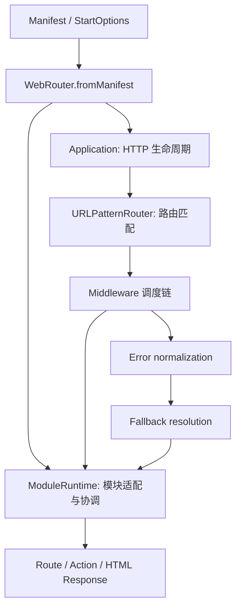
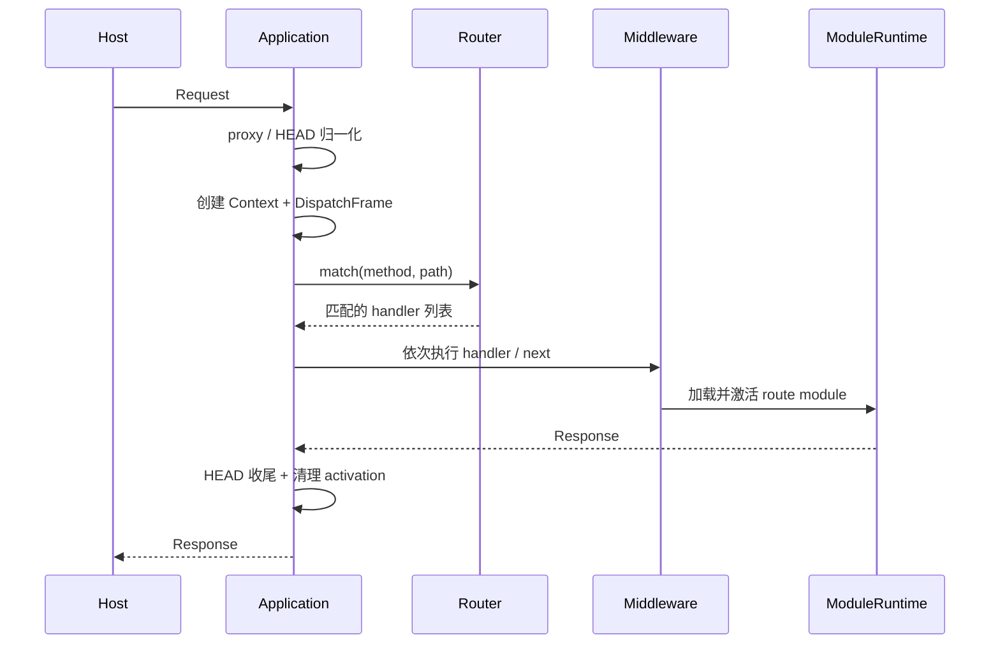
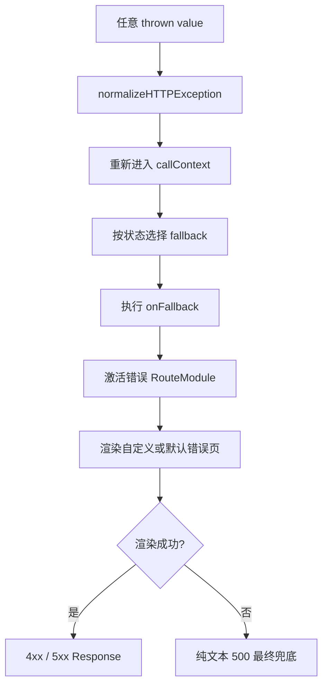

# Web Router 贡献指南

本文档面向需要修改 `@web-widget/web-router` 内部实现的贡献者，重点说明架构边界、请求流程和验证方式。使用方法请阅读 [README.zh.md](./README.zh.md)，模块格式请阅读 [`@web-widget/schema`](../schema/README.md)。

## 快速开始

```bash
git clone https://github.com/web-widget/web-widget.git
cd web-widget
pnpm install
cd packages/web-router
```

常用命令：

```bash
pnpm test             # 运行单元测试
pnpm run test:watch   # 监听模式
pnpm run test:coverage
pnpm run test:memory-leak
pnpm run lint
pnpm run build        # 构建 JavaScript 和类型声明
```

测试由 Vitest 和 `@cloudflare/vitest-pool-workers` 执行，运行环境与 Cloudflare Workers 保持一致。

## 架构概览

Web Router 分为装配、HTTP 调度、路由匹配、模块运行时、渲染和错误处理六个部分。



### 模块职责

| 模块             | 职责                                                    |
| ---------------- | ------------------------------------------------------- |
| `index.ts`       | 从 manifest 创建并装配完整 `WebRouter`                  |
| `application.ts` | 请求生命周期、middleware 调度、rewrite、HEAD 和错误边界 |
| `router/`        | 路由注册和编译后的 URLPattern 匹配                      |
| `context.ts`     | 单次请求状态、延迟 Request、rewrite 和 `waitUntil`      |
| `module/`        | schema 模块加载、handler 适配、路由激活和渲染           |
| `error.ts`       | 异常归一化、错误状态判断和 fallback 路由                |
| `layout.ts`      | 默认页面布局                                            |
| `fallback.ts`    | 默认错误页面                                            |
| `types.ts`       | schema 类型汇总和 router 自身类型                       |

### 目录结构

```text
packages/web-router/src/
├── index.ts
├── application.ts
├── context.ts
├── error.ts
├── fallback.ts
├── layout.ts
├── types.ts
├── url.ts
├── router/
│   ├── index.ts
│   ├── base.ts
│   └── url-pattern.ts
└── module/
    ├── index.ts       # ModuleRuntime facade
    ├── activation.ts  # 请求级路由激活状态
    ├── handler.ts     # Handler 规范化
    ├── loader.ts      # Runtime 级模块加载
    ├── renderer.ts    # Route/Layout 渲染
    └── index.test.ts
```

`module/index.ts` 是唯一的运行时 facade。内部组件不会通过包入口导出，调用方继续使用 `import './module'`。

## 启动装配

`WebRouter.fromManifest()` 把声明式 manifest 编译为 Application 的 handler 注册序列。注册顺序就是请求执行顺序的一部分：

```text
RouteContextHandler
→ callContext
→ MiddlewareHandler
→ ActionHandler
→ RouteHandler
```

1. `RouteContextHandler` 确定匹配的 route module，并准备 route activation。
2. `callContext` 建立 AsyncLocalStorage/unctx 上下文。
3. 普通 middleware 在 action 和最终 route 之前执行。
4. Action 仅处理 POST JSON-RPC 请求。
5. `RouteHandler` 执行业务 handler，或者进入默认 HTML 渲染。
6. 最后安装 404 和通用错误处理器。

修改注册顺序可能改变 middleware 可见的 context、错误捕获范围和最终响应，必须增加集成测试。

## 请求主流程

请求入口是 `Application.handler()`，测试入口是 `Application.dispatch()`。



关键行为：

- HEAD 请求内部按 GET 匹配，但保留 `originalRequest`，最终移除响应 body。
- 单个同步 handler 走快速路径，避免创建递归 dispatcher 和额外 Promise。
- 多个 handler 通过 `next()` 串联；重复调用 `next()` 会抛错。
- handler 必须返回 `Response`，缺少返回值或返回其他类型会进入错误边界。
- proxy 模式会在匹配前规范化转发请求。
- 请求结束后清除 route activation；存在 `waitUntil()` 时延迟到后台任务完成。

## ModuleRuntime

`ModuleRuntime` 将 schema 模块转换为 Application 可以执行的 middleware，同时协调四个内部组件。

| 内部组件        | 职责                                                             |
| --------------- | ---------------------------------------------------------------- |
| `activation.ts` | 用 WeakMap 保存请求级 route 状态，并安装/移除 Context accessor   |
| `handler.ts`    | 把函数或 HTTP method map 规范化为统一 handler                    |
| `loader.ts`     | 缓存异步 module loader、合并并发加载、失败后允许重试             |
| `renderer.ts`   | 合并 meta、执行 route/layout render、隐藏错误详情并创建 Response |

### 缓存边界

缓存分成两层，不能混用：

```text
ModuleRuntime 实例缓存
  ├── RouteModule → handler / meta / renderer / render / html
  └── loader 函数 → 共享的加载 Promise

请求级 activation
  └── Context → module / meta / data / error / bound render functions
```

- 模块缓存属于 `ModuleRuntime` 实例，因为 layout、default meta、renderer 和 `exposeErrors` 都是 Runtime 配置。
- 同一个 loader 在 context、route 和 error handler 之间共享加载结果。
- 并发首请求共享同一个 Promise；加载失败会清除 pending 状态，后续请求可以重试。
- activation 只属于一个请求，不能存入 Runtime 模块缓存。

## 渲染流程

Route module 和错误 module 使用同一条渲染管道：

```text
route data / error
→ 选择 module.default 或 module.fallback
→ route module render()
→ layout module render()
→ status / headers / streaming headers
→ Response
```

`renderer.ts` 负责：

- 合并默认 meta、route meta 和开发环境 meta。
- 根据 `exposeErrors` 决定是否隐藏 `stack` 和 `cause`。
- progressive 响应设置 `x-accel-buffering: no`。
- progressive 响应默认设置 `cache-control: no-store, no-transform`。
- 保留 route 显式提供的 status、statusText 和 headers。

## 错误流程



错误边界接受 `Error`、`Response`、对象、字符串和其他 JavaScript 抛出值。归一化过程自身不得再次抛错。

Fallback 选择规则：

1. 优先使用精确状态，例如 418。
2. 其他 4xx 使用 400；没有 400 时兼容使用 404。
3. 其他 5xx 使用 500。
4. 没有自定义模块时使用内置 fallback。

`onFallback` 是诊断钩子。它的同步或异步失败会被记录，但不能阻止错误页面渲染。错误页面自身渲染失败时，Application 返回最终的纯文本 500。

## Rewrite 流程

`context.rewrite()` 在同一个请求生命周期内切换内部 Request 并重新匹配：

1. 根据当前 Request 创建新的内部 Request。
2. 只允许相对地址或同源地址。
3. 使用 pathname、search 和 method 判断 route view 是否变化。
4. 检测重复访问路径，循环时产生 508。
5. route view 变化时清除旧 activation。
6. 使用新 method/path 重新匹配，并跳过已经执行的 handler。
7. rewrite 完成后恢复调用方 Request，同时把新 Request 传给后续 middleware。

Rewrite、middleware 和 activation 共享 `DispatchFrame`。修改其中任一部分时，应同时覆盖同步 handler、异步 handler、嵌套 `next()`、循环 rewrite 和错误路径。

## 模块格式

Web Router 遵循 `@web-widget/schema` 定义的技术无关模块格式。

```typescript
interface RouteModule {
  handler?: RouteHandler | RouteHandlers;
  render?: ServerRender;
  meta?: Meta;
  default?: RouteComponent;
  fallback?: RouteFallbackComponent;
}
```

核心模块类型：

- `RouteModule`：HTTP handler 和页面渲染。
- `MiddlewareModule`：请求处理和 context 修改。
- `ActionModule`：客户端可调用的 JSON-RPC action。
- `LayoutModule`：页面外层布局渲染。

模块边界应保持框架无关，只依赖 Fetch API、ReadableStream 和 schema 类型。

## 设计约束

- `Application` 管 HTTP 生命周期，不加载或渲染 schema 模块。
- `Router` 只负责注册和匹配，不执行业务 handler。
- `ModuleRuntime` 是 facade，具体加载、激活和渲染逻辑放在 `module/` 内部组件。
- Runtime 缓存不得保存请求数据，也不得跨 Runtime 共享配置相关结果。
- 错误页面与普通页面共享渲染管道，但必须遵守 `exposeErrors`。
- 公共 API 和 manifest 格式变更需要同步 schema、README、changeset 和集成测试。
- 请求热路径修改需要保留同步快速路径，并评估额外 URL、Request、Promise 和闭包分配。

## 开发工作流

提交前至少运行：

```bash
pnpm run lint
pnpm run build
pnpm test
```

涉及 activation 或后台任务时额外运行：

```bash
pnpm run test:memory-leak
```

测试应覆盖正常响应和失败路径。缓存修改至少覆盖：

- 同一 Runtime 内的复用。
- 不同 Runtime 之间的隔离。
- 并发首次加载。
- 加载失败后的重试。
- 错误详情不会跨 Runtime 暴露。

## 代码阅读顺序

1. `types.ts`：公共数据结构。
2. `context.ts`：请求状态和 host adapter 边界。
3. `router/`：匹配结果如何生成。
4. `application.ts`：请求如何被调度。
5. `module/index.ts`：schema 模块如何接入调度链。
6. `module/activation.ts` 和 `module/loader.ts`：状态与缓存边界。
7. `module/renderer.ts`：SSR 和错误详情处理。
8. `index.ts`：manifest 如何装配完整 Router。

实际使用和端到端行为可参考 `playgrounds/router`。

## 提交检查清单

- [ ] 修改符合上述职责边界。
- [ ] 正常、错误和边界路径都有测试。
- [ ] lint、build 和相关测试通过。
- [ ] 公共行为变化包含 changeset。
- [ ] 中英文文档保持同步。
- [ ] 保持 Workers 和标准 Fetch API 兼容。
- [ ] 评估性能、缓存隔离和内存释放。
