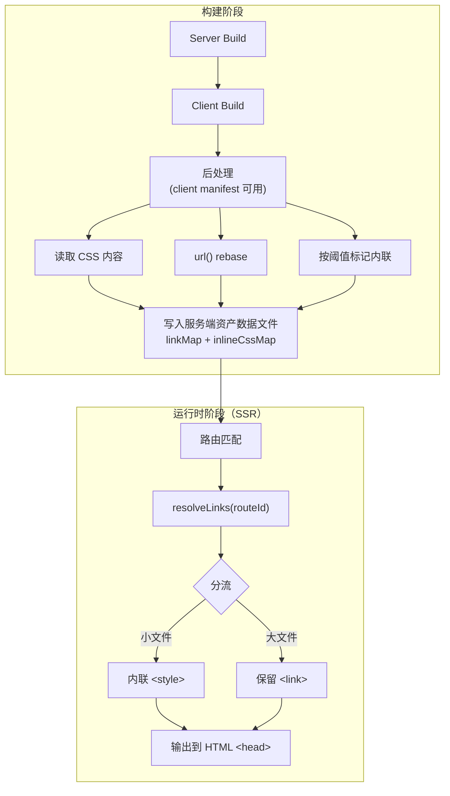

# RFC: CSS 合并与内联策略

状态：草案

## 动机

在 SSR 渲染路由时，框架会为每个 CSS 文件生成单独的 `<link rel="stylesheet">` 标签。在大型项目中，一个路由可能依赖数十个 CSS 模块（CSS Modules、全局样式、组件样式等），导致 HTML `<head>` 中出现大量 `<link>` 标签。

这带来两个问题：

- **HTTP 请求数过多**：每个 `<link>` 标签触发一次独立的 HTTP 请求，增加网络开销和连接竞争。
- **渲染阻塞**：浏览器在加载并解析所有样式表前会阻塞渲染，大量 `<link>` 标签延长了首屏渲染时间（FCP/LCP）。

## 提议

CSS 的传输策略不应一刀切。不同 CSS 文件在大小、共享范围、加载时机上差异很大，应当根据特征分流处理。本 RFC 提出一套分层策略，将多种手段组合为最佳实践，在减少请求数、利用缓存、控制 HTML 体积之间取得平衡。

目标：

- **减少渲染阻塞请求**：通过内联小 CSS 文件，消除不必要的 HTTP 往返。
- **保留缓存能力**：大 CSS 文件仍作为外部资源，享受浏览器和 CDN 缓存。
- **保持 CSS HMR**：开发模式下不改变 CSS 加载方式，保证热更新的简单可靠。
- **可配置**：提供清晰的配置项，允许项目按需调整策略。

非目标：

- 不改变 CSS code splitting 的拆分粒度（由 Vite 原生能力决定）。
- 不处理 CSS 的 `@import` 合并（由打包器负责）。
- 不在开发模式启用内联。
- 不实现 CSS chunk 合并或共享样式提取（作为未来可选增强）。

## 详细设计

核心思路：**按大小阈值分流**——小文件内联消除渲染阻塞，大文件保留外部链接利用缓存。在构建时将 CSS 内容嵌入服务端资产数据，运行时按路由匹配提取并合并，避免运行时文件 I/O。

### 整体数据流

本框架的构建管线采用 **server 先 → client 后** 的构建顺序。client 构建完成后，Vite client manifest 可用，此时从 client 输出中收集 CSS 文件内容，与已有的 link 预计算同步处理，一并写入服务端资产数据文件。



### 构建阶段：CSS 内容收集

构建后处理阶段（client manifest 可用后），在现有的 link 预计算管线中扩展 CSS 内容收集：

1. **遍历 linkMap 中的 CSS 条目**，从 client 构建输出目录读取每个 CSS 文件的内容和字节数。
2. **处理 `url()` rebase**：内联后的 CSS 脱离了原始文件路径，其中的相对 `url()` 引用（如 `url(./bg.png)`）需要 rebase 为正确的绝对路径。使用 `lightningcss` 在构建时完成转换。
3. **按阈值标记内联**：根据阈值（默认 8KB）决定哪些 CSS 文件适合内联。

扩展后的服务端资产数据结构：

```typescript
interface ServerAssetsData {
  /** 资产 URL 映射（已有） */
  assetUrls: Record<string, string>;
  /** 路由 → link 描述符列表（已有） */
  linkMap: Record<string, LinkDescriptor[]>;
  /** 路由 → 该路由可内联的 CSS 内容（新增） */
  inlineCssMap?: Record<string, InlineCssEntry[]>;
}

interface InlineCssEntry {
  /** 对应的 CSS href（用于与 linkMap 中的条目匹配） */
  href: string;
  /** 处理过 url() rebase 的 CSS 内容 */
  content: string;
}
```

设计要点：

- **linkMap 保持不变**：`LinkDescriptor[]` 结构不改，内联决策在渲染层完成，不影响 link 预计算的现有逻辑。
- **inlineCssMap 按路由组织**：与 `linkMap` 的 key 对齐（路由的相对路径），运行时只需一次查找。
- **只存储建议内联的 CSS**：大于阈值的 CSS 不进入 `inlineCssMap`，控制数据文件体积。`strategy: 'never'` 时整个 `inlineCssMap` 为空。
- **url() rebase 在构建时完成**：结果直接存入 `inlineCssMap`，运行时无解析开销。

> **为什么构建时收集而非运行时读取？** 本框架的构建管线已经在 client manifest 可用后执行 link 预计算，CSS 内容收集可以复用同一时机。运行时文件 I/O 在高并发下会成为瓶颈，且 `url()` rebase 需要解析 CSS，运行时做会增加每请求延迟。构建时预收集将所有重活提前，运行时只需字符串拼接。这一模式已被 TanStack Router 验证。

### 运行时阶段：内联决策与输出

运行时利用框架已有的 meta 系统（`meta.link` + `meta.style`）输出 CSS：

1. **收集当前路由的 link 列表**（已有的 `resolveLinks(routeId)` 调用）。
2. **查询 inlineCssMap**：检查当前路由是否有可内联的 CSS。
3. **分流输出**：
   - 在 `inlineCssMap` 中的 CSS → 提取 `content`，合并为单个字符串，放入 `meta.style`（一个 `StyleDescriptor`）。
   - 不在 `inlineCssMap` 中的 CSS → 保留为 `meta.link`（`LinkDescriptor` with `rel: 'stylesheet'`）。
4. **框架已有的 HTML 渲染逻辑**会将 `meta.link` 渲染为 `<link>` 标签，`meta.style` 渲染为 `<style>` 标签。

关键细节：

- **复用 meta 系统**：框架已支持 `StyleDescriptor`（含 `content`、`media` 字段），内联 CSS 只需填充 `meta.style`，无需新的 HTML 渲染逻辑。
- **合并为单个 `<style>` 块**：所有内联 CSS 合并为一个 `StyleDescriptor`（`content` 为拼接后的字符串），而非每个文件一个，避免 HTML 中出现大量 `<style>` 标签。
- **路由级匹配**：`inlineCssMap` 按路由 key 索引，只包含当前路由匹配到的 CSS，控制 HTML 体积。
- **防止重复加载**：已内联的 CSS 从 `meta.link` 列表中移除（不放入 `linkMap` 的返回结果），从源头上避免客户端水合时重复加载。

### 每请求控制

支持在运行时动态决定是否内联，适用于 A/B 测试、User-Agent 适配等场景：

```typescript
type InlineCssResolver = (ctx: {
  request: Request;
}) => boolean | Promise<boolean>;
```

- 返回 `true`：使用 `inlineCssMap` 中的预计算结果。
- 返回 `false`：跳过内联，所有 CSS 保留为 `meta.link`。

未配置时默认启用内联。内联结果按路由 + 内联开关缓存（LRU），避免重复拼接。

### 开发模式

开发模式不启用内联，保持现有的 CSS 收集方式不变：

- 开发模式已通过模块图遍历收集 CSS，返回 `{ link, style, script }`。
- 内联仅作为生产模式的构建时优化，开发模式继续使用 `<link>` 标签，保证 CSS HMR 的简单可靠。

## 配置设计

配置作为 `webRouterPlugin` 选项的一部分，与 `filesystemRouting`、`serverAction` 等同级，遵循框架现有的 zod schema 模式：

```typescript
// vite.config.ts
export default defineConfig({
  plugins: [
    webRouterPlugin({
      filesystemRouting: { enabled: true },
      css: {
        inline: {
          strategy: 'auto', // 默认
          threshold: 8192, // 默认 8KB
        },
      },
    }),
  ],
});
```

Schema 定义：

```typescript
const CssInlineSchema = z
  .object({
    strategy: z.enum(['auto', 'always', 'never']).optional().default('auto'),
    threshold: z.number().int().min(0).optional().default(8192),
  })
  .optional()
  .default({});

const CssSchema = z
  .object({
    inline: CssInlineSchema,
  })
  .optional()
  .default({});
```

设计说明：

- **三选一策略**（参考 Astro 的 `'always' | 'auto' | 'never'`）比 `boolean` + `threshold` 更清晰，消除 `inline: false` 与 `threshold: 0` 的语义重叠。
- `'auto'`（默认）：按大小阈值自动选择，平衡请求数与缓存。
- `'always'`：内联所有 CSS（无论大小），适用于将 CSS 完全内联的场景。
- `'never'`：不内联，所有 CSS 保留为 `<link>`，回退到现有行为。
- 阈值默认 8KB（高于 Astro 的 4KB），因为本框架按路由拆分 CSS，单路由的 CSS 总量通常更大，适当提高阈值能内联更多小文件。

## 边界情况

### `url()` rebase

内联 CSS 中的相对路径引用需要 rebase 为绝对路径，否则资源加载失败。在构建时使用 `lightningcss` 统一处理：

- `url(./images/icon.png)` → `url(/assets/images/icon-abc123.png)`
- 包含 hash 的资源路径在构建时已确定，无需运行时处理。
- 支持 `@import` 中的相对路径（虽然 code splitting 下 `@import` 已被打包器内联，作为防御性处理）。

### 全局 CSS 与 CSS Modules

两者处理方式一致，都按大小阈值分流。CSS Modules 的作用域哈希在构建时已生成，内联不影响其作用域隔离。

### 条件渲染组件的 CSS

路由匹配阶段收集的 CSS 已包含条件渲染组件的样式（基于模块依赖图，而非实际渲染结果）。内联不会遗漏这些样式。

### 空文件与极小文件

大小为 0 的 CSS 文件直接跳过，不生成 `<style>` 也不生成 `<link>`。

### 构建顺序兼容性

本框架采用 server 先 → client 后的构建顺序。CSS 内容收集在 client 构建完成后的后处理阶段执行（与现有 link 预计算同步），此时 client 输出目录中的 CSS 文件已就绪。单独执行 server 构建时（无 client 构建），`inlineCssMap` 为空，所有 CSS 保留为 `<link>`，功能不受影响。

## 对其他功能的影响

- **CSS HMR**：内联仅影响生产模式，开发模式保持现有 CSS 收集方式不变。
- **浏览器缓存**：内联的小文件不可被浏览器单独缓存，但小文件缓存价值有限，且会被 brotli/gzip 压缩传输。保留为 `<link>` 的大文件仍可被浏览器和 CDN 缓存。
- **SSR 性能**：CSS 内容在构建时预收集嵌入数据文件，运行时仅做字符串查找和拼接（按路由缓存），无文件 I/O 开销。
- **HTML 体积**：内联会增加 HTML 体积，但通过阈值控制（默认 8KB）和路由级匹配（只内联当前路由的 CSS），增量可控。brotli 压缩后实际增量更小。
- **数据文件体积**：`inlineCssMap` 会增大服务端资产数据文件（`.server-assets.js`），但该文件仅在服务端加载，不影响客户端 bundle。

## 替代方案

### 禁用 CSS Code Splitting

将所有 CSS 合并为单个文件（`cssCodeSplit = false`，Qwik 的做法）：

- **优点**：实现最简单（一行配置），彻底消除多个 `<link>`。
- **缺点**：首次加载包含大量当前路由不需要的样式；任何 CSS 变化导致整个文件缓存失效；失去按路由拆分的按需加载能力。

本提议的分层策略在减少请求数的同时，保留了路由级 CSS 拆分能力，以适度复杂度换取显著更好的缓存粒度和首屏性能。

### CSS Chunk 合并

在构建后合并小 CSS chunk 为大 chunk（Next.js 的做法）：

- **优点**：减少 `<link>` 数量的同时保持 CSS 为外部文件（可缓存）。
- **缺点**：实现复杂度最高——需要分析模块依赖图、保证 CSS 导入顺序不被违反、处理 chunk 间共享模块。只有 Next.js 实现了完整的合并算法，其他主流框架均未采用。

### 共享样式提取

被多个路由共享的 CSS 提取为公共 chunk：

- **优点**：避免不同路由重复加载相同样式，减少冗余请求。
- **缺点**：需要分析跨路由的 CSS 依赖关系和导入顺序，实现复杂度接近 CSS Chunk 合并。

以上两项作为未来可选增强保留，待内联策略稳定后再评估。

## 参考

### 业界策略概览

| 框架            | 核心策略                 | 关键原理                                      |
| --------------- | ------------------------ | --------------------------------------------- |
| Next.js         | CSS Chunk 合并           | 构建时将小 chunk 合并为大 chunk，保护导入顺序 |
| SvelteKit       | CSS 内联                 | 小于阈值的 CSS 内联到 `<style>`，合并为一个块 |
| Nuxt            | CSS 内联                 | 组件级样式内联，构建时移除已内联的 link       |
| Astro           | CSS 传播/去重 + 阈值内联 | 小 CSS 内联，大 CSS 保留 link；`'auto'` 模式  |
| Qwik            | 禁用 code split + 内联   | 全局 CSS 合并为单文件，组件 CSS SSR 内联      |
| React Router 7  | 路由级收集 + 可选合并    | 支持 `cssCodeSplit: false` 全局合并           |
| SolidStart      | 开发时内联，生产时 link  | 模块图遍历收集 CSS，引用计数去重              |
| TanStack Router | 构建时内联               | CSS 内容嵌入 manifest，运行时路由匹配内联     |

- **CSS 内联是最主流的策略**：SvelteKit、Nuxt、TanStack Router、SolidStart（开发模式）都采用内联方案。
- **构建时收集 + 运行时匹配是成熟模式**：TanStack Router 将 CSS 内容在构建时嵌入 manifest，运行时按路由匹配提取并合并，兼顾了正确性和灵活性。
- **禁用 CSS code splitting 是最简单的方案**：Qwik 通过一行配置将所有 CSS 合并为单文件，但牺牲了按路由拆分的能力。
- **CSS chunk 合并实现复杂度最高**：只有 Next.js 实现了真正的 chunk 合并算法，需要处理导入顺序约束，其他框架均未采用此方案。
- **`url()` rebase 是内联方案的必要配套**：TanStack Router 使用 `lightningcss` 处理内联 CSS 中的相对路径引用，这是内联方案必须解决的边界问题。

灵感来源：

| 设计决策                   | 主要参考框架    | 借鉴点                                  |
| -------------------------- | --------------- | --------------------------------------- |
| 构建时收集 CSS 内容        | TanStack Router | CSS 内容嵌入数据文件，避免运行时 I/O    |
| 大小阈值自动分流           | Astro           | `'auto'` 模式 + `inlineStylesheets`     |
| 合并为单个 `<style>`       | SvelteKit       | `Array.join('\n')` 合并内联样式         |
| 从 link 列表移除已内联 CSS | TanStack Router | `stripInlinedStylesheetAssetsFromRoute` |
| 每请求控制                 | TanStack Router | `handlerInlineCss` 回调                 |
| `url()` rebase             | TanStack Router | `lightningcss` 处理相对路径             |
| 三选一策略配置             | Astro           | `'always'` `'auto'` `'never'`           |

### 参考资料

- [CSS 合并/内联策略调研文档](./references/css-merging-research.zh.md)
- [TanStack Router - manifestBuilder.ts](https://github.com/TanStack/router/blob/main/packages/start-plugin-core/src/start-manifest-plugin/manifestBuilder.ts)
- [TanStack Router - ssr-server.ts](https://github.com/TanStack/router/blob/main/packages/router-core/src/ssr/ssr-server.ts)
- [TanStack Router - inlineCss.ts](https://github.com/TanStack/router/blob/main/packages/start-server-core/src/inlineCss.ts)
- [SvelteKit - render.js](https://github.com/sveltejs/kit/blob/main/packages/kit/src/runtime/server/page/render.js)
- [Astro - plugin-css.ts](https://github.com/withastro/astro/blob/main/packages/astro/src/core/build/plugins/plugin-css.ts)
- [Qwik - vite.ts](https://github.com/QwikDev/qwik/blob/main/packages/qwik/src/optimizer/src/plugins/vite.ts)
- [Next.js - css-chunking-plugin.ts](https://github.com/vercel/next.js/blob/canary/packages/next/src/build/webpack/plugins/css-chunking-plugin.ts)
