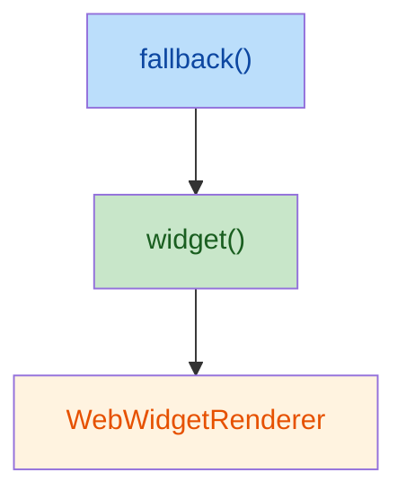

# RFC：HTML 模板 Widget 孤岛设计

状态：已实现

## 摘要

定义 `@web-widget/html` 中 Widget 孤岛的架构设计：HTML 模板作为服务端外壳，框架 Widget（React、Vue、Vue2 等）作为交互孤岛嵌入其中。通过 `WidgetTransform` 协议，构建工具自动注入 `render()` 和 `widget()`，使用户无需手动编写样板代码。同时定义类型适配方案，使 Widget 导入在 TypeScript 中获得正确的类型提示。

## 背景

### HTML 模板的定位

`@web-widget/html` 是服务端模板引擎，用 tagged template 生成流式 HTML。它负责路由、布局、错误页等"外壳"职责，不处理客户端交互。

当页面需要局部交互时，引入框架 widget 作为孤岛——`<web-widget>` 自定义元素负责客户端加载和水合，与宿主模板完全解耦。

### 孤岛架构的三层自治

与 [React 孤岛设计](./react-widget-opinionated-design.zh.md)一样，每个 widget 孤岛需要：

1. **隔离**：一个 widget 的故障不影响页面其他部分
2. **自治**：widget 内部自行管理加载、错误、恢复
3. **独立**：widget 有自己的生命周期、状态、渲染根

### 与 React 孤岛的区别

React 孤岛在 React 组件树内运行，需要处理 React 流式 SSR 特有的错误恢复（Suspense Promise reject → `$RC` 替换 → ErrorBoundary 兜底）。

HTML 模板不存在这些复杂度：

| 问题       | React 孤岛                                 | HTML 模板               |
| ---------- | ------------------------------------------ | ----------------------- |
| 错误隔离   | `WidgetErrorBoundary` + `Suspense` + `$RC` | `fallback()` 模板函数   |
| 流式协调   | Promise reject 协议                        | async iterable 天然流式 |
| 客户端水合 | 路由级无 hydration，widget 独立 hydrate    | 相同                    |
| 状态更新   | React 组件树驱动                           | 不需要（静态 HTML）     |

## 设计方案

### 1. 构建转换协议

`@web-widget/html/transform` 导出 `WidgetTransform` 定义，匹配 `.ts` / `.js` 扩展名：

```typescript
import type { WidgetTransform } from '@web-widget/schema';

export default {
  name: 'html',
  extensions: ['.ts', '.js'],
  adapter: '@web-widget/html/adapter',
} satisfies WidgetTransform;
```

构建工具对 `.html.ts` / `.html.js` 文件执行两种自动注入：

- **`render()` 注入**：`Page@route.html.ts` 不再需要 `export { render }`
- **`widget()` 注入**：导入 Widget 时自动包装为可调用函数

项目通常在配置中为 HTML transform 设置 `scope`，只匹配 HTML 模板所在目录，避免与原生 JS 模块（`VanillaCounter@widget.ts`）和 API 路由（`api/hello@route.ts`）冲突。

### 2. 封装结构



| 层                    | 职责                                        | 实现方式                                      |
| --------------------- | ------------------------------------------- | --------------------------------------------- |
| **fallback()**        | 捕获渲染错误，渲染替代 HTML                 | 模板函数，async iterable 层面 try/catch       |
| **widget()**          | 将 Widget 模块渲染为 `<web-widget>` HTML    | `WebWidgetRenderer.renderOuterHTMLToString()` |
| **WebWidgetRenderer** | 加载模块、调用 `render()`、输出 HTML 字符串 | `@web-widget/web-widget` 提供的框架无关渲染器 |

### 3. widget() 函数与 widget prop

**`widget()` 函数**（构建工具注入，来自 `./runtime`）：

```typescript
import Counter from './Counter@widget.tsx';
// 构建工具自动转换为：
// const Counter = widget(() => import('./Counter@widget.tsx'), { import: '...', name: 'Counter' });

// Widget 自身的 props 直接平铺，widget prop 控制容器行为
html`<div>${Counter({ count: 1, widget: { serverOnly: true } })}</div>`;
```

`widget()` 返回的函数接受 `HtmlWidgetProps`——Widget 自身的 props 直接展开，`widget` prop 持有容器配置：

```typescript
type HtmlWidgetProps<T = unknown> = T & {
  /** 容器配置，与 widget 自身的 props 隔离 */
  widget?: WidgetContainerConfig;
};

type WidgetContainerConfig = {
  /** 客户端加载策略 */
  loading?: 'auto' | 'lazy' | 'eager' | 'idle';
  /** 仅服务端渲染，产出静态 HTML，不挂载客户端 */
  serverOnly?: true;
  /** 仅客户端渲染，不产出服务端 HTML */
  clientOnly?: true;
};
```

这与 React 适配器的 `widget` prop 设计完全一致——容器配置与 Widget 自身的 props 物理隔离，避免命名冲突。

### 4. 类型适配

构建工具将 `import Counter from './Counter@widget.tsx'` 转换为 `widget()` 调用后，`Counter` 的运行时类型变为 `HtmlWidgetComponent`。但 TypeScript 在构建前已经按原始模块解析了类型——React widget 的默认导出是 `React.FC`，不是 `HtmlWidgetComponent`。

React 适配器使用 `asReactWidget` 类型辅助函数解决跨框架 widget 导入的类型问题。HTML 适配器采用同样的模式，提供 `asHtmlWidget`：

```typescript
import Counter from './Counter@widget.tsx';
import { asHtmlWidget } from '@web-widget/html/adapter';

// 类型层面转换：React.FC → HtmlWidgetComponent<{ count: number }>
const HtmlCounter = asHtmlWidget<{ count: number }>(Counter);

// 现在调用时获得正确的类型提示
html`<div>${HtmlCounter({ count: 1 })}</div>`;
```

`asHtmlWidget` 是纯类型转换（type cast），不做任何运行时操作：

```typescript
export function asHtmlWidget<T>(component: unknown): HtmlWidgetComponent<T> {
  return component as HtmlWidgetComponent<T>;
}
```

用户通过泛型参数 `T` 显式声明 widget 的数据类型，获得类型检查和自动补全。

未来可以通过构建工具生成类型声明文件（如 `Counter@widget.tsx.d.ts`）来提供精确的类型推导，但这需要构建工具的额外支持，属于后续演进方向。

### 5. 错误处理

利用 HTML 模板已有的 `fallback()` 函数：

```typescript
${fallback(
  Counter({ count: 1 }),
  () => html`<div class="error">Widget failed</div>`
)}
```

- `Counter()` 内部的 `renderOuterHTMLToString()` reject
- `fallback()` 捕获错误，渲染替代 HTML
- 不影响页面其他部分

这与 React 的 `WidgetErrorBoundary` 目标一致，但实现更简单——不需要 class component + `getDerivedStateFromError` + `$RC` 流式替换协议。

**已知限制**：错误恢复仅在服务端生效。客户端 widget 水合失败（如模块加载 404）时，用户看到的是空的 `<web-widget>` 元素。这与 React 孤岛设计的客户端限制一致。

### 6. 流式行为

HTML 模板的 async iterable 机制天然支持流式：

1. **立即发送** Promise 之前的 HTML（如 `<!doctype html>...<h1>Dashboard</h1>`）
2. **等待** widget 的 `renderOuterHTMLToString()` resolve
3. **发送** widget HTML（`<web-widget>...</web-widget>`）
4. **继续发送** Promise 之后的 HTML

与 React Suspense 效果一致，但不需要 `$RC` 占位符替换协议。

**注意**：widget 内部渲染是 `progressive: false`（完整字符串）。这与 React widget 行为一致——`WebWidgetRenderer.renderInnerHTMLToString()` 也强制非流式。

### 7. 客户端水合

无需额外代码。`<web-widget>` 自定义元素独立处理：

```
connectedCallback → load() → bootstrap() → mount()
```

widget 模块通过 `import` 属性独立加载，执行 `ClientRender` 生命周期，不依赖宿主 HTML 模板。

## API 总结

```typescript
// 用户 API（从 @web-widget/html 导入）
import { html, fallback } from '@web-widget/html';
// 适配器 API（从 @web-widget/html/adapter 导入）
import { asHtmlWidget, render } from '@web-widget/html/adapter';
// 构建工具注入的 widget（用户不直接导入）
// import { widget } from '@web-widget/html/adapter';

// 用户 API（从 @web-widget/helpers 导入）
import { defineRouteComponent, defineMeta } from '@web-widget/helpers';
```

## 使用示例

### 基本路由（自动注入 `render()`）

```typescript
// Page@route.html.ts
import { html } from '@web-widget/html';

export default function Page() {
  return html`<h1>Hello World</h1>`;
}
// 构建工具自动注入 render()，无需 export { render }
```

### 导入 Widget（自动注入 `widget()` + 类型适配）

```typescript
// Dashboard@route.html.ts
import Counter from './Counter@widget.tsx';
import { html, fallback } from '@web-widget/html';
import { asHtmlWidget } from '@web-widget/html/adapter';

const HtmlCounter = asHtmlWidget<{ count: number }>(Counter);

export default function Page() {
  return html`<div>
    <h1>Dashboard</h1>
    ${fallback(
      HtmlCounter({ count: 42 }),
      () => html`<div>Widget unavailable</div>`
    )}
  </div>`;
}
```

## 已知限制

### Widget 内部不支持流式渲染

`WebWidgetRenderer.renderInnerHTMLToString()` 强制 `progressive: false`。

### @layout 文件需要手动导出 `render()`

`MARKERS_RE` 只匹配 `@route` 和 `@widget`，不匹配 `@layout`。这对所有适配器一致。

### .ts / .js 文件不受 adapter 影响

`.ts` / `.js`（而非 `.html.ts` / `.html.js`）的路由/widget 文件不会被任何 adapter 处理，用户需手动导出。这是有意为之——保持与原生 JS 模块的兼容。

### 类型推导需要手动声明

`asHtmlWidget<T>` 的泛型 `T` 需要用户手动指定，无法自动从 widget 源文件推导。这与 React 适配器的 `asReactWidget` 面临同样的限制。未来可以通过构建工具生成类型声明文件来提供自动推导。

## 参考

- [React Widget 孤岛设计](./react-widget-opinionated-design.zh.md)
- [框架组件构建转换协议](./build-transformation-protocol.zh.md)
