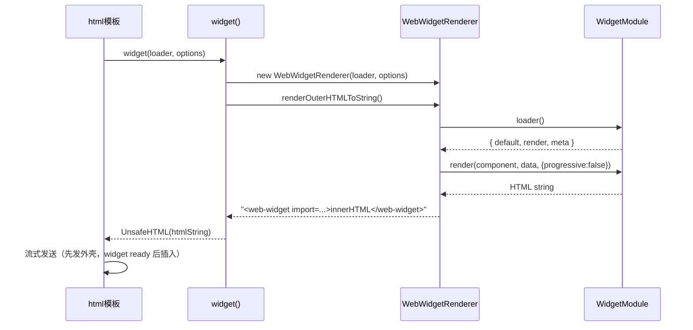

# RFC：HTML 模板中的 Widget 孤岛

状态：已实现

## 摘要

为 `@web-widget/html` 新增 `widget()` 函数，使 HTML 模板可以像引用普通模板片段一样引用 React / Vue / Vue2 等框架的 widget，并在客户端自动水合。HTML 模板充当服务端外壳（layout、路由、数据获取），widget 作为交互孤岛嵌入其中，复用已有的 `<web-widget>` 自定义元素机制。

## 动机

当前 `@web-widget/html` 是纯服务端模板引擎：用 tagged template 生成流式 HTML，没有客户端交互能力。如果项目同时需要：

- **轻量的服务端渲染**：用 HTML 模板写路由、layout、错误页，不需要引入 React/Vue 全家桶
- **局部的客户端交互**：某些区域需要 React/Vue 组件（计数器、表单、图表等）

则没有原生方案。用户只能选择：

1. 全站迁移到 React/Vue 适配器——引入框架运行时开销，服务端渲染变重
2. 手动拼接 `<web-widget>` HTML 字符串——容易出错，无法利用类型检查和流式渲染

本 RFC 的目标是让 HTML 模板原生支持 widget 孤岛，使两种能力可以无缝组合。

## 背景

### 现有架构回顾

`<web-widget>` 自定义元素（`@web-widget/web-widget`）是框架无关的容器：

```
服务端：WebWidgetRenderer.renderOuterHTMLToString()
  → loader() 加载 WidgetModule
  → 调用 module.render(component, data, {progressive: false}) 渲染为 HTML 字符串
  → 输出 <web-widget import="..." contextdata="...">innerHTML</web-widget>

客户端：HTMLWebWidgetElement (custom element)
  → connectedCallback → load() → bootstrap() → mount()
  → 独立加载 widget 模块，执行 ClientRender 生命周期
  → 不依赖宿主页面的框架
```

关键点：**widget 的服务端渲染和客户端水合都不依赖宿主模板**。React/Vue 的 `container()` 函数之所以存在，是因为框架组件需要被包装为原生组件（React.FC / Vue.Component）才能在组件树中使用。HTML 模板没有组件树，只需要拿到 widget 的 HTML 字符串并插入模板流。

### 与框架适配器的区别

| 维度                    | React/Vue `container()`                    | HTML `widget()`                   |
| ----------------------- | ------------------------------------------ | --------------------------------- |
| 返回类型                | 框架原生组件（React.FC / Vue.Component）   | `Promise<UnsafeHTML>`（模板节点） |
| 错误隔离                | `WidgetErrorBoundary` + `Suspense` + `$RC` | `fallback()` 模板函数             |
| 流式协调                | React Suspense Promise reject 协议         | async iterable 天然流式           |
| 构建转换                | 需要（JSX/SFC → 通用模块）                 | 不需要（模板是普通函数）          |
| `WebWidgetAdapter` 协议 | 需要（`webWidget` 字段 + `./runtime`）     | 不需要                            |

`widget()` 不是框架适配器，不声明 `webWidget` 字段，不需要构建转换。它只是一个运行时工具函数，复用 `WebWidgetRenderer`。

## 提议

### API

```typescript
import type { Loader, WebWidgetRendererOptions } from '@web-widget/web-widget';

/**
 * 将框架 widget 嵌入 HTML 模板。
 *
 * 在服务端渲染为 <web-widget> 元素的 HTML 字符串，
 * 客户端由 <web-widget> 自定义元素自动加载并水合。
 *
 * @param loader Widget 模块加载器
 * @param options 渲染选项
 * @returns Promise<UnsafeHTML>，可直接插入 html`` 模板
 */
export function widget(
  loader: Loader,
  options?: WidgetOptions
): Promise<UnsafeHTML>;

interface WidgetOptions extends WebWidgetRendererOptions {
  // WebWidgetRendererOptions 已有的字段：
  // - data: 传递给 widget 的数据（序列化为 contextdata 属性）
  // - loading: 客户端加载策略 ('lazy' | 'eager' | 'idle')
  // - name: widget 名称
  // - renderTarget: 渲染目标 ('light' | 'shadow')
  // - renderStage: 渲染阶段 ('server' | 'client')
}
```

`widget()` 返回 `Promise<UnsafeHTML>`。由于 HTML 模板的插值机制已经支持 Promise（async iterable），可以直接在 `html`` ` 中使用：

```typescript
import { html, render, widget, fallback } from '@web-widget/html';

export { render };

export default function Page() {
  return html`<!doctype html>
    <html>
      <body>
        <h1>My Page</h1>
        ${fallback(
          widget(() => import('./Counter@widget.tsx'), {
            data: { count: 1 },
            loading: 'lazy',
          }),
          () => html`<div>Widget failed to load</div>`
        )}
      </body>
    </html>`;
}
```

### 实现原理



核心实现约 10 行：

```typescript
import {
  WebWidgetRenderer,
  type Loader,
  type WebWidgetRendererOptions,
} from '@web-widget/web-widget';
import { unsafeHTML } from './html';

export function widget(
  loader: Loader,
  options: WebWidgetRendererOptions = {}
): Promise<UnsafeHTML> {
  const renderer = new WebWidgetRenderer(loader, options);
  return renderer.renderOuterHTMLToString().then(unsafeHTML);
}
```

### 流式行为

HTML 模板的 async iterable 机制天然支持流式：

1. **立即发送** Promise 之前的 HTML（如 `<!doctype html>...<h1>My Page</h1>`）
2. **等待** `renderOuterHTMLToString()` resolve（widget 服务端渲染完成）
3. **发送** widget HTML（`<web-widget>...</web-widget>`）
4. **继续发送** Promise 之后的 HTML

这意味着用户在等待 widget 渲染时，已经能看到页面外壳。与 React Suspense 的效果一致，但不需要 `$RC` 占位符替换协议。

**注意**：widget 内部内容是 `progressive: false`（渲染为完整字符串再嵌入）。这与 React container 的行为相同——`WebWidgetRenderer.renderInnerHTMLToString()` 也强制 `progressive: false`。模板级流式已经覆盖了主要收益（数据获取期间先发送外壳 HTML）。

### 错误处理

利用 html 已有的 `fallback()` 模板函数实现错误隔离：

```typescript
${fallback(
  widget(() => import('./Counter@widget.tsx'), { data: { count: 1 } }),
  () => html`<div class="error">Widget failed</div>`
)}
```

当 widget 渲染失败时：

- `renderOuterHTMLToString()` reject
- `fallback()` 捕获错误，渲染替代 HTML
- 不影响页面其他部分

这与 React 的 `WidgetErrorBoundary` 目标一致（错误限制在单个孤岛内），但实现更简单——不需要 class component + `getDerivedStateFromError`。

### 客户端行为

无需额外代码。`<web-widget>` 自定义元素（`@web-widget/web-widget`）已经实现了完整的客户端生命周期：

```
connectedCallback
  → load()：通过 import 属性加载 widget 模块
  → bootstrap()：调用 ClientRender，获取 mount/unmount 生命周期
  → mount()：在渲染根中挂载组件
```

widget 模块（如 `Counter@widget.tsx`）经过构建转换后导出 `render`（ClientRender），由 `<web-widget>` 元素独立加载和执行，不依赖宿主 HTML 模板。

## 与 React Widget 孤岛设计（RFC 1）的关系

[React 孤岛设计](./react-widget-opinionated-design.zh.md)解决的是 **React 组件树内** 的 widget 错误恢复问题：

- React 流式 SSR 中，Promise reject 会导致 Suspense 永久 loading
- 需要 `WidgetErrorBoundary` + `.catch(err => err)` + `$RC` 机制来恢复
- 客户端需要 `WidgetErrorBoundary` 来捕获 hydration 错误

HTML 模板不存在这些问题：

- 没有 React 流式 SSR，没有 Suspense Promise reject
- `fallback()` 模板函数在 async iterable 层面捕获错误
- 客户端没有组件树需要 hydration（路由 HTML 是静态的）

因此 `widget()` 是 React 孤岛设计的一个**简化子集**：同样的孤岛架构（widget 隔离 + 服务端渲染 + 客户端水合），但省去了 React 特有的错误恢复机制。

## 依赖变更

`@web-widget/html` 需要新增 `@web-widget/web-widget` 作为 dependency：

```json
{
  "dependencies": {
    "@web-widget/helpers": "workspace:*",
    "@web-widget/web-widget": "workspace:*"
  }
}
```

`@web-widget/web-widget` 已经是 `@web-widget/react`、`@web-widget/vue`、`@web-widget/vue2` 的依赖，体量可控。

## 导出

从 `@web-widget/html` 的 `.` 入口导出：

```typescript
// server.ts
export { widget } from './widget';
```

客户端（`client.ts`）导出 `notImplemented` stub，与 `render`、`html` 等保持一致：

```typescript
export const widget = notImplemented('widget');
```

## 已知限制

### Widget 内部不支持流式渲染

`WebWidgetRenderer.renderInnerHTMLToString()` 强制 `progressive: false`，widget 内部渲染为完整字符串后才嵌入模板流。如果 widget 内部需要长时间数据获取，整个模板流会在该位置等待。

这与 React container 行为一致。如果未来需要 widget 内部流式，需要扩展 `WebWidgetRenderer` 支持 `progressive: true` + ReadableStream 嵌入，属于另一个 RFC 的范畴。

### 不支持 serverOnly / clientOnly

当前 `WidgetOptions` 继承 `WebWidgetRendererOptions`，可以通过 `renderStage: 'server'` 或 `renderStage: 'client'` 控制。但不提供 React container 的 `serverOnly` / `clientOnly` 布尔语法糖——HTML 模板用户可以直接设置 `renderStage`。

如果后续发现需求，可以增加便捷选项。

## 使用示例

### 基本用法

```typescript
import { html, render, widget } from '@web-widget/html';

export { render };

export default function Page() {
  return html`<div>
    <h1>Dashboard</h1>
    ${widget(() => import('./Chart@widget.tsx'), { data: { type: 'bar' } })}
  </div>`;
}
```

### 带错误恢复

```typescript
import { html, render, widget, fallback } from '@web-widget/html';

export { render };

export default function Page() {
  return html`<div>
    <h1>Dashboard</h1>
    ${fallback(
      widget(() => import('./Chart@widget.tsx'), { data: { type: 'bar' } }),
      () => html`<div class="error">Chart unavailable</div>`
    )}
  </div>`;
}
```

### 懒加载

```typescript
${widget(
  () => import('./HeavyWidget@widget.vue'),
  { loading: 'lazy' }  // 滚动到可视区域时才加载
)}
```

### 仅服务端渲染（静态 HTML，无客户端水合）

```typescript
${widget(
  () => import('./StaticReport@widget.tsx'),
  { renderStage: 'server' }
)}
```
