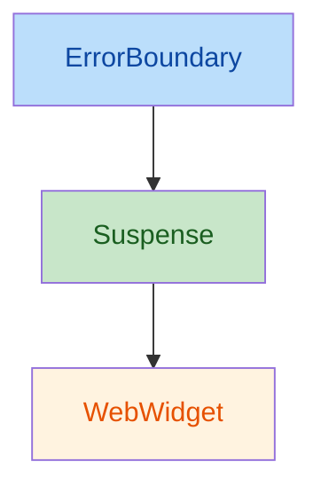
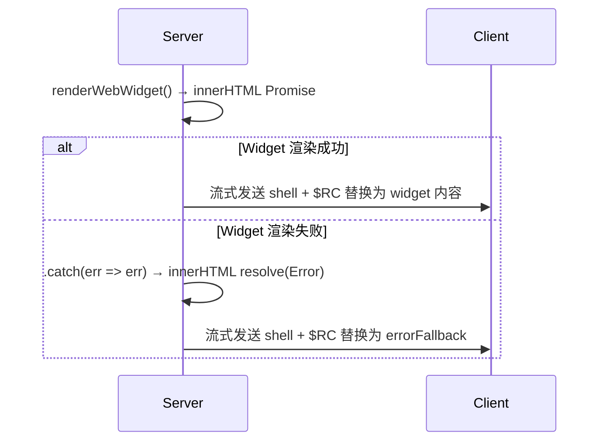

# RFC：React Widget 孤岛设计

状态：已实现

## 摘要

定义 `@web-widget/react` 中 `defineWebWidget` 的架构设计：将每个 widget 封装为自治的"孤岛"，内部集成 Suspense（加载管理）与 ErrorBoundary（错误隔离），通过统一的 `fallback` API 暴露加载态与错误态的控制能力。

## 背景

### Widget 在架构中的角色

`defineWebWidget` 将一个 widget 模块封装为 React 组件。该组件在服务端渲染 `<web-widget>` 自定义元素的 HTML，在客户端由 custom element 接管模块的加载、引导和挂载。

```tsx
const Counter = defineWebWidget(() => import('./Counter@widget.tsx'));

function Page() {
  return <Counter fallback={<Spinner />} count={1} />;
}
```

### 孤岛架构的三层自治

孤岛架构要求每个 widget 具备：

1. **隔离**：一个 widget 的故障不影响页面其他部分
2. **自治**：widget 内部自行管理加载、错误、恢复
3. **独立**：widget 有自己的生命周期、状态、渲染根

### 错误传播的约束

web-widget 架构中，路由组件被渲染为静态 HTML，不存在路由级 React hydration。每个 `<web-widget>` 元素在客户端独立 hydrate。

这意味着 React 流式 SSR 的标准错误恢复机制（Suspense 内 Promise reject → 客户端重试 → ErrorBoundary 兜底）**不适用**：没有路由级 React root 来执行客户端重试，reject 会导致 loading fallback 永久停留。

## 设计方案

### 1. 封装结构



| 层                      | 职责                                                                 | 实现方式                                     |
| ----------------------- | -------------------------------------------------------------------- | -------------------------------------------- |
| **WidgetErrorBoundary** | 捕获渲染错误（非流式模式），隔离故障                                 | class component + `getDerivedStateFromError` |
| **Suspense**            | 等待 `use(innerHTML)` resolve，期间显示 loadingFallback              | `<Suspense fallback={loadingFallback}>`      |
| **WebWidget**           | 渲染 `<web-widget>` 元素；若 innerHTML 为 Error 则渲染 errorFallback | `use()` + `.catch(err => err)`               |

### 2. fallback API

`fallback` 支持两种形式，通过 `resolveFallback` 统一解析：

```tsx
// 简单形式：ReactNode，同时用于 loading 和 error
<Widget fallback={<Spinner />} />

// 对象形式：分别指定
<Widget fallback={{ loading: <Spinner />, error: <ErrorUI /> }} />
```

解析规则：

| fallback 值                                    | loadingFallback | errorFallback                   |
| ---------------------------------------------- | --------------- | ------------------------------- |
| `undefined`                                    | `undefined`     | `undefined`                     |
| `<Spinner />`                                  | `<Spinner />`   | `<Spinner />`                   |
| `{ loading: <Spinner /> }`                     | `<Spinner />`   | `<Spinner />`（回退到 loading） |
| `{ error: <ErrorUI /> }`                       | `undefined`     | `<ErrorUI />`                   |
| `{ loading: <Spinner />, error: <ErrorUI /> }` | `<Spinner />`   | `<ErrorUI />`                   |

### 3. 错误处理机制

核心机制：在 `renderWebWidget` 中将 `innerHTML` Promise 的 rejection 转换为 resolution（Error 对象）。`WebWidget` 检测到 `use(innerHTML)` 返回 Error 后，正常 `return` errorFallback 而非 `throw`。

```tsx
// renderWebWidget: Promise 永不 reject
const innerHTML = widget.renderInnerHTMLToString().catch(
  (err: unknown) => (err instanceof Error ? err : new Error(String(err)))
);

// WebWidget: 检测 Error，渲染 errorFallback（不 throw）
function WebWidget({ localName, attributes, innerHTML, errorFallback }) {
  const html = use(innerHTML);
  if (html instanceof Error) {
    return createElement(Fragment, null, errorFallback);
  }
  return createElement(localName, { ... });
}
```

**为什么不用 throw？** throw 会导致 React 流式 SSR 放弃该子树（永久 loading fallback），因为 islands 架构没有路由级 hydration 来执行客户端重试。正常 return errorFallback 让 React 完成流式渲染，errorFallback 通过 `$RC` 机制替换 loading fallback。

### 4. 数据流



### 5. 服务端 render 函数

**流式模式**（`progressive: true`）：包裹 `RouteErrorBoundary` 防止 shell 错误中断流。`onError` 始终调用 `console.error`（符合 React 文档要求）。

**非流式模式**（`progressive: false`）：不包裹 `RouteErrorBoundary`。shell 错误直接 reject Promise，由 web-router 框架的 `_500` 错误路由处理，返回正确的 500 状态码。

### 6. suppressHydrationWarning

React 在客户端 hydrate 时会校验服务端 HTML 与客户端首次渲染输出是否一致。但 `<web-widget>` 的 innerHTML 在两个环境中必然不同：

| 环境   | innerHTML 来源                                      | 内容                                      |
| ------ | --------------------------------------------------- | ----------------------------------------- |
| 服务端 | `ServerWebWidgetRenderer.renderInnerHTMLToString()` | 调用 widget 的 `render()` 产出的完整 HTML |
| 客户端 | `ClientWebWidgetRenderer.renderInnerHTMLToString()` | `<!--web-widget:placeholder-->` 占位符    |

服务端需要输出实际内容以支持流式渲染和 SEO；客户端输出占位符，因为真正的 DOM 由 custom element 生命周期（`load → bootstrap → mount`）在独立渲染根中构建。这是 islands 架构的固有特征，不是 bug。

使用 `dangerouslySetInnerHTML` + `suppressHydrationWarning`。`suppressHydrationWarning` 只作用于当前元素（不递归），语义上声明"React 不管理此节点的内容"。这是准确的——`<web-widget>` 的 innerHTML 由 custom element 接管，React 只负责渲染元素本身及其属性。

```tsx
createElement(localName, {
  ...attributes,
  dangerouslySetInnerHTML: { __html: html },
  suppressHydrationWarning: true, // innerHTML 由 custom element 管理，不由 React 管理
});
```

## API 总结

```tsx
type WidgetFallback = ReactNode | { loading?: ReactNode; error?: ReactNode };

interface WebWidgetSuspenseProps {
  /** 加载态和错误态的占位 UI */
  fallback?: WidgetFallback;
  /** 模块加载策略 */
  experimental_loading?: 'lazy' | 'eager' | 'idle';
  /** 渲染阶段 */
  renderStage?: 'server' | 'client';
  /** 渲染目标 */
  experimental_renderTarget?: 'light' | 'shadow';
}
```

## 已知限制

### 客户端错误恢复不可用

当前设计在**服务端**完整处理 loading 与 error 状态——errorFallback 在服务端确定并通过 `$RC` 流式输出到客户端。但一旦 HTML 到达浏览器后，**无法在客户端层面恢复或重试失败的 widget**。

原因在于 islands 架构没有路由级 React hydration：路由组件的 React 树在服务端渲染为静态 HTML 后销毁，客户端不存在对应的 React 组件实例。因此：

- **`WidgetErrorBoundary` 不在客户端运行**：它是 React class component，但客户端没有挂载它的 React 根。
- **`fallback` 的 `{ error }` 分支只在服务端生效**：客户端收到的已经是最终的 HTML（widget 内容或 errorFallback），没有 React 重试机制来改变它。
- **custom element 生命周期错误无法回传 React**：`<web-widget>` 在客户端的 `load → bootstrap → mount` 失败时通过 `reportError` 全局报告，但没有 React ErrorBoundary 能捕获并渲染替代 UI。

这意味着如果 widget 在服务端渲染成功但客户端 hydration 阶段失败（如模块加载 404、客户端 API 不兼容），用户看到的是空的 `<web-widget>` 元素或残缺内容，而非 errorFallback。

要实现客户端错误恢复，需要引入路由级 React hydration——让整个路由组件树在客户端重建。但这会将架构从 "islands"（孤岛）变为传统 React SSR（如 Next.js、Remix），是一个更大的架构决策，涉及客户端 bundle 体积增加、hydration 性能开销、以及与其他框架适配器（Vue、Vue2）的协调机制变化。

在当前 islands 架构下，custom element 自身的错误处理（`statuschange` 事件、`reportError` 全局报告）是客户端错误的处理渠道，应用层可通过监听全局错误事件实现自定义降级逻辑。

## 未来演进

- **错误上报钩子**：`DefineWebWidgetOptions` 中增加 `onError` 回调
- **超时降级**：在 Suspense 层集成超时机制

## 参考

- [React: renderToReadableStream](https://react.dev/reference/react-dom/server/renderToReadableStream)
- [React: Error Boundaries](https://react.dev/reference/react/Component#catching-rendering-errors-with-an-error-boundary)
- [react-error-boundary](https://github.com/bvaughn/react-error-boundary)
