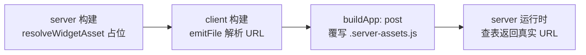

# RFC：Widget 资产 URL 解析

状态：已实现

## 摘要

定义构建工具如何将 Widget 模块的源文件路径解析为客户端 chunk URL，使不同技术栈的前端 UI 组件（React、Vue、Solid 等）在导入 Widget 模块时，构建产物能正确引用对应的 hashed chunk。

## 背景

Widget 是独立的客户端模块，构建后产出独立的 hashed chunk。前端 UI 组件通过 `container` 导入 Widget 模块：

```javascript
// 源码：React 组件导入 Widget
import Counter from "./Counter@widget.tsx";

// 插件 transform 后
const Counter = container(() => import("./Counter@widget.tsx"), {
  import: ???,  // 应填入什么？
  name: "Counter"
});
```

`<web-widget>` 自定义元素需要通过 `import` 属性知道 chunk URL，才能在浏览器中加载模块。生产构建时，源文件路径 `./Counter@widget.tsx` 会被 Rolldown 重写为 hashed chunk URL `./Counter@widget.tsx-HASH.js`，但这个 URL 在 transform 阶段不可知。

构建顺序为 [server → client](./widget-module-build.zh.md)，server 构建时 client manifest 尚不存在，因此服务端无法在 transform 阶段内联真实的 client chunk URL。客户端的 URL 解析机制是本 RFC 的焦点。

## 动机

不同技术栈的前端 UI 组件（React、Vue、Solid 等）在导入 Widget 模块时，构建工具需要正确处理模块引用，确保：

1. **构建产物正确**：Widget 模块被编译为独立的 hashed chunk，UI 组件能正确引用它
2. **跨技术栈一致**：无论宿主 UI 框架是 React、Vue 还是 Solid，Widget 模块的 URL 解析行为一致
3. **构建顺序兼容**：适配 server → client 反向构建顺序，server 构建时不依赖 client manifest

核心挑战在于：transform 阶段生成 `container` 调用时，hashed chunk URL 尚不可知。需要一种机制在构建时或运行时填补这个信息缺口。

## 详细设计



### 服务端：`resolveWidgetAsset` 运行时查表

`resolveWidgetAsset` 是一个运行时函数，接收 Widget 模块的源文件路径（相对于项目根目录）作为参数，返回对应的客户端 chunk URL。

```javascript
// server transform 产物
container(() => import('./Counter@widget.tsx'), {
  import: resolveWidgetAsset('routes/(components)/Counter@widget.tsx'),
  name: 'Counter',
});
```

由于 server 构建时 client manifest 尚不存在，`resolveWidgetAsset` 通过 `virtual:web-widget-server-assets` 虚拟模块间接查询。该虚拟模块静态导入 `.server-assets.js` 数据文件：

- **server 构建时**：写入占位内容（空数据），`resolveWidgetAsset` 返回 `undefined`
- **client 构建完成后**：`buildApp: post` 钩子用内存中的 client manifest 覆写 `.server-assets.js`，填入真实的 chunk URL 映射
- **server 运行时**：`resolveWidgetAsset` 查询已覆写的 `.server-assets.js`，返回 `"/assets/Counter@widget-HASH.js"`

运行时查表无法在 transform 阶段暴露路径错误（拼写错误、widget 未进入 client bundle 等）。为此，`buildApp: post` 钩子在覆写 `.server-assets.js` 前做一次构建期校验：将 server `buildStart` 阶段通过 `this.resolve` 爬 import 图收集的所有 widget 模块路径，与 client manifest 实际产出的 chunk 交叉比对。任一被引用的 widget 在 manifest 中缺失对应 chunk，构建立即失败并输出缺失路径，把错误提前到构建阶段。

### 客户端：`ROLLUP_FILE_URL` 构建时解析

`emitFile` + `import.meta.ROLLUP_FILE_URL_*`，Rolldown 在构建时解析 URL。

```javascript
// 客户端 transform
const referenceId = this.emitFile({
  type: 'chunk', id: moduleId, preserveSignature: 'allow-extension', importer: id,
});
container(() => import("./Counter@widget.tsx"), {
  import: import.meta.ROLLUP_FILE_URL_${referenceId},
  name: "Counter"
});
// Rolldown 解析后
container(() => import("./Counter@widget.tsx-HASH.js"), {
  import: new URL("Counter@widget-HASH.js", import.meta.url).href,
  name: "Counter"
});
```

> 客户端保留 `() => import()` loader。虽然 `<web-widget>` 元素运行时使用 `import` 属性而非 loader，但 `() => import()` 在 manifest 中创建 `dynamicImports` 边，CSS 收集逻辑依赖此边发现嵌套 widget 的 CSS。省略 loader 会导致嵌套 widget CSS 丢失。

## 备选方案

### `parseModuleId` 运行时提取

服务端机制相同（`resolveWidgetAsset` 运行时查表）。客户端省略 `import` 选项，运行时从 loader 函数体正则提取 URL。

```javascript
// 客户端 transform（省略 import）
container(() => import('./Counter@widget.tsx'), {
  name: 'Counter',
});
// Rolldown 重写 import() 路径
container(() => import('./Counter@widget.tsx-HASH.js'), {
  name: 'Counter',
});
```

```javascript
// 浏览器运行时：parseModuleId 从 loader 函数体提取 URL
const loader = () => import('./Counter@widget.tsx-HASH.js');
const source = String(loader); // "() => import('./Counter@widget.tsx-HASH.js')"
const match = source.match(/import\(["'`]([^"'`]*)["'`]\)/);
const moduleId = match[1]; // "./Counter@widget.tsx-HASH.js"
// → 写入 <web-widget import="./Counter@widget.tsx-HASH.js">
```

## 方案对比

| 方面            | 提议方案：`ROLLUP_FILE_URL` | 备选方案：`parseModuleId`                      |
| --------------- | --------------------------- | ---------------------------------------------- |
| 客户端 URL 时机 | ✅ 构建时                   | ❌ 运行时                                      |
| 重复 chunk      | ⚠️ 入口 widget 有包装器     | ✅ 无                                          |
| 构建顺序兼容性  | ✅ 兼容 server → client     | ✅ 兼容 server → client                        |
| 复杂度          | 中（需 `emitFile`）         | 低                                             |
| Rolldown 稳定性 | ✅ 无                       | ⚠️ Rolldown 改变 `import()` 输出格式会影响正则 |
