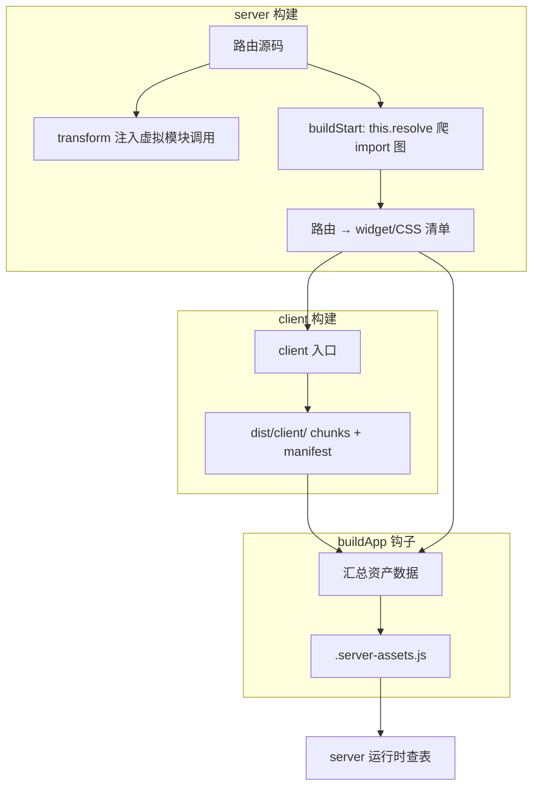

# RFC：Widget Module 双环境反转构建

状态：已实现

## 摘要

将 Widget Module 的双环境构建顺序从传统的 `client → server` 反转为 `server → client`。server 侧通过虚拟模块间接引用 client 资产，真实资产数据在 client 构建后由 `buildApp` 钩子统一写入，server 运行时查表解析。由此解耦 server transform 与 client manifest，使 server 构建可在 client 构建前独立完成，并支持 alias / workspace 包解析。

## 背景：Widget Module 是什么

`@web-widget/schema` 定义了技术无关的模块格式。其中 Widget Module 与 React 的 Client Component 在职责上类似：可在服务端渲染外壳，在客户端加载实现并完成水合。

```typescript
// Server Widget Module
interface ServerWidgetModule {
  default?: unknown;
  meta?: Meta; // HTML head：link、script、style 等
  render?: ServerRender;
}

// Client Widget Module
interface ClientWidgetModule {
  default?: unknown;
  meta?: Meta;
  render?: ClientRender;
}
```

同一份 widget 源码在 **client** 与 **server** 两个 Vite 环境中会被编译成不同语义：client 产出真实 chunk，server 只保留对 client 资产的间接引用。这正是本 RFC 要解决的核心问题——如何在 Vite 8 Environment API 下正确编排这两个环境的构建，使 server 侧能引用 client 产物而不强依赖 client manifest。

## 动机

原有 `client → server` 顺序存在两个痛点：

1. **server transform 强依赖 client manifest**：server 构建必须等 client 构建完成才能开始，无法并行；server chunk 内联了 manifest 数据，client 更新需重新构建 server。
2. **alias / workspace 包不支持**：client 入口发现阶段（`configEnvironment`）只能用默认 resolver，不支持 alias / tsconfig / workspace 包导入，导致 alias widget 无法进入 client bundle。

## 目标

- server 构建不依赖 client manifest，可在 client 构建前独立完成
- 构建顺序自由可编排，符合 Vite 8 Environment API 官方推荐的框架集成模式
- 运行时仍能正确解析 hashed asset URL 与 CSS link
- widget 作为独立 entry，便于预加载与 importmap 引用

## 设计方案

### 1. 流程图



### 2. 总体构建顺序

`vite build` 时，通过 Vite 8 `builder.buildApp` 在同一进程内**先构建 server、再构建 client**：

```
builder.build(server)   →  产出 server chunk（引用虚拟资产模块）
        ↓
builder.build(client)   →  产出 hashed chunks + .manifest.json
        ↓
buildApp (post)         →  读 client manifest，写 .server-assets.js
```

**为什么反转？** 反转后，server 构建期只产出「引用虚拟模块」的代码，真实资产数据在 client 构建后由 `buildApp` 钩子统一写入一个 ES 模块，server 运行时通过静态 import 加载该模块并查表。server transform 完全解耦 client manifest，构建顺序可自由反转。

### 3. server 环境：虚拟资产模块 + 运行时查表

server 构建阶段产出的 chunk **不内联任何 client 资产 URL**，而是统一通过虚拟模块 `virtual:web-widget-server-assets` 间接引用。server transform 注入的代码只有两种调用形式：解析 widget 资产 URL（`resolveWidgetAsset`）和解析路由所需的 CSS/preload 链表（`resolveLinks`）。

虚拟模块的代码是**固定的**（不依赖 client manifest）：它静态 import 另一个虚拟数据模块，数据模块在运行时通过 `import.meta.url` + `new URL(..., import.meta.url).href` 推算数据文件路径并用动态 `import()` 加载一个 ES 模块。该数据模块内容在 client 构建后才生成，server 运行时按需加载查表。因此 server chunk 可以安全地在 client 构建前打包完成。

### 4. client 环境：产出真实资产 + manifest

client 构建时，路由/页面中的 widget 引用被改写为 `defineWebWidget` 容器，并通过 Rolldown 原生的 `new URL(specifier, import.meta.url).href` 解析带 hash 的 chunk URL（与动态 `import()` 共享同一模块图，无需 `emitFile`）。client 构建产出标准 Vite manifest 与 hashed chunks。

### 5. buildApp 钩子：生成运行时资产数据

所有环境构建完成后，`buildApp` 钩子（`order: 'post'`）汇总资产数据：

1. 读取 client manifest
2. 结合 server 构建期收集的路由 widget/CSS 清单
3. 生成两类映射：
   - `assetUrls`：模块相对路径 → hashed URL
   - `linkMap`：模块相对路径 → CSS / modulepreload / preload 链表（含路由模块与 widget 模块）
4. 序列化写入 `dist/server/assets/.server-assets.js`（一个导出 `assetUrls` / `linkMap` 的 ES 模块）

server 运行时通过虚拟模块加载该 ES 模块完成查表。

### 6. server 构建期资产收集：import 图驱动

client build 的入口必须在 `configEnvironment` 阶段确定，此时 Rolldown 尚未初始化。本方案采用 **server 构建期 import 图驱动** 发现 widget/CSS：

server 构建的 `buildStart` 阶段用 Rolldown 的 `this.resolve`（支持 alias / tsconfig / 第三方 resolver）递归爬取每条路由模块的 import 图，收集路由静态引用的 CSS 与路由静态/动态引用的 widget。结果存入共享状态，供两处复用：

- **client 构建入口**：仅被路由引用的 CSS/widget 才进 client bundle
- **buildApp 资产写入**：生成 `linkMap` 的 key 集合

**为什么用 `this.resolve` 而非默认 resolver？** `configEnvironment` 阶段只能用不支持 alias 的本地 resolver；`buildStart` 阶段 Rolldown 已初始化，`this.resolve` 可正确解析 alias / tsconfig / workspace 包。本方案在 `buildStart` 使用独立的解析结果缓存，避免与 `configEnvironment` 阶段的失败结果互相污染。

## 与 Vite 8 Environment API 的关系

Vite 8 [Environment API](https://vite.dev/guide/api-environment) 与 [Frameworks 指南](https://vite.dev/guide/api-environment-frameworks) 明确：

- 每个环境（`client`、`server` 等）拥有独立的 `moduleGraph`、`pluginContainer`
- 生产构建通过 `ViteBuilder` 编排；**环境构建顺序由框架决定**，`builder.build(server)` 后再 `builder.build(client)` 是合法且常见的反转模式
- 插件用 `applyToEnvironment` 限定 hook 作用范围，用 `sharedDuringBuild: true` 在双构建间共享状态
- `buildApp` 钩子在所有环境构建完成后执行，适合做跨环境的资产汇总

本方案正是基于上述机制设计：

| Vite 8 机制                              | 本方案用法                                                  |
| ---------------------------------------- | ----------------------------------------------------------- |
| `builder.buildApp`                       | server → client → `buildApp` 写 JS 模块的顺序编排           |
| `configEnvironment`                      | 为 client/server 注入独立 `outDir`、`rolldownOptions.input` |
| `applyToEnvironment`                     | 声明式限定 server 专用插件的作用范围                        |
| `RunnableDevEnvironment.runner.import()` | dev 每请求加载 server entry                                 |
| `sharedDuringBuild`                      | 跨插件、跨环境共享构建期状态                                |
| `buildApp` (post)                        | 汇总 client manifest + 路由资产清单 → 运行时 JS 模块        |

Vite 社区正在讨论将 manifest 挂到 `BuildEnvironment` 上，若成为稳定 API，server 运行时的磁盘文件读取可进一步替换为内存读取。

## 构建顺序策略的权衡

`client → server` 与 `server → client` 不是简单的顺序差异，而是两种不同的复杂度分配策略，各自在不同的阶段引入限制：

### client → server

**信息流**：client 构建产出 manifest → server transform 读取 manifest → 内联 hashed URL 到 server chunk。

**复杂度分配**：

- **server transform 简单**：manifest 已可用，直接读取并内联，server chunk 自包含、无运行时依赖。
- **client 入口发现困难**：client 的 `rolldownOptions.input` 必须在 `configEnvironment` 阶段确定，此时 Rolldown 尚未初始化，无法使用 `this.resolve`。只能用不支持 alias / tsconfig / workspace 包的本地 resolver，或退化为磁盘扫描 / lexer 解析。

### server → client

**信息流**：server `buildStart` 用 `this.resolve` 爬 import 图 → client 构建用收集到的入口 → `buildApp` 汇总 manifest → 写运行时 JS 模块 → server 运行时查表。

**复杂度分配**：

- **client 入口发现简单**：推迟到 server 的 `buildStart` 阶段，Rolldown 已初始化，`this.resolve` 原生支持 alias / tsconfig / workspace 包，无需额外发现逻辑。
- **server 引用解析变复杂**：server chunk 不能内联真实 URL（client 还没构建），必须引入虚拟模块 + 运行时查表 + 额外的 `.server-assets.js` 文件依赖。

### 权衡总结

| 维度         | client → server                     | server → client                          |
| ------------ | ----------------------------------- | ---------------------------------------- |
| 入口发现能力 | 受限于 `configEnvironment` resolver | `buildStart` 的 `this.resolve`，能力完整 |
| server 产物  | 自包含，无运行时依赖                | 依赖 `.server-assets.js`                 |
| alias 支持   | 无法支持                            | 原生支持                                 |
| 构建并行性   | server 必须等 client 完成           | server 可独立先构建                      |
| 复杂度来源   | 入口发现逻辑（磁盘扫描 / lexer）    | 运行时查表机制（虚拟模块 + JS 模块）     |

## 与其它方案对比

### 与 @vitejs/plugin-rsc 对比

[@vitejs/plugin-rsc](https://github.com/vitejs/vite-plugin-react/tree/main/packages/plugin-rsc) 基于 Vite Environment API 定义三个生产环境（rsc + server + client），边界由 `"use client"` / `"use server"` / `server-only` 标记：

| 环境   | 条件 / 职责                                                                             |
| ------ | --------------------------------------------------------------------------------------- |
| rsc    | `react-server` 条件；`renderToReadableStream` 序列化 RSC payload；处理 Server Functions |
| server | 反序列化 RSC stream → React VDOM → `react-dom/server` 输出 HTML                         |
| client | 反序列化 RSC、hydration、客户端重取 RSC、`rsc:update` HMR                               |

> 注：`@vitejs/plugin-react`（非 RSC）仅处理 React 编译与 HMR，不定义 client/server 组件边界，也不编排双环境构建，因此不作为对比对象。

| 维度                    | @vitejs/plugin-rsc                         | 本方案                                                 |
| ----------------------- | ------------------------------------------ | ------------------------------------------------------ |
| 环境数量                | rsc + server + client（3）                 | client + server（2）                                   |
| 构建顺序                | rsc → client → server（rsc 先于 client）   | server → client（反转，server 不依赖 client manifest） |
| 边界标记                | `"use client"`、`server-only`              | `@widget` 后缀 + `defineWebWidget`                     |
| server 对 client 的引用 | Client Reference（RSC stream 内嵌引用 ID） | 虚拟模块 + 运行时 JS 查表                              |
| 跨环境 Build            | 静态 import 重写 + manifest 文件           | 虚拟模块 + `.server-assets.js`（buildApp 钩子写入）    |
| 序列化协议              | RSC Flight stream（`react-server-dom`）    | HTML + `meta` + 标准 ESM chunk URL                     |
| 框架耦合                | 提供 RSC runtime，框架可自建路由           | 绑定 `@web-widget/web-router` + Widget Module schema   |

核心相似点：两种方案都让 server 侧不打包 client 运行时代码，只保留对 client 产物的间接引用；构建期都需要某种形式的跨环境数据传递。

核心差异：

1. plugin-rsc 用 React 官方的 RSC 协议在运行时传递组件树；本方案用 URL + meta 在 HTML 层描述要加载的 chunk。
2. plugin-rsc 显式拆出 `rsc` 环境处理 `react-server` 条件；本方案在 server 环境内完成服务端渲染，无独立第三环境。
3. plugin-rsc 提供一等跨环境 API；本方案在构建期用 transform + 运行时 JS 查表完成引用解析。
4. **构建顺序**：plugin-rsc 的 rsc 必须先于 client（rsc 产出引用 ID）；本方案反转为 server 先于 client，靠虚拟模块 + 运行时 JS 模块解耦。

### 与其它元框架对比

| 框架                    | 模型             | client/server 边界            | Manifest / 引用方式                       | 构建顺序                |
| ----------------------- | ---------------- | ----------------------------- | ----------------------------------------- | ----------------------- |
| 本方案                  | Widget Module    | `@widget` + `defineWebWidget` | 虚拟模块 + `.server-assets.js` 运行时查表 | server → client（反转） |
| Remix / React Router v7 | Route Module     | loader/action + 同构组件      | Vite client manifest → server 注入 assets | client → server         |
| SvelteKit               | Svelte 组件      | `.server` / 自动 client 检测  | client manifest → `<script>` / `<link>`   | client → server         |
| Nuxt 3                  | Vue 组件 + Nitro | 自动 server/client 拆分       | Vite client manifest → Nitro server 渲染  | client → server         |
| SolidStart              | Solid 组件       | `server$` 等                  | Vite 双环境 + manifest                    | client → server         |
| Astro                   | Islands          | `client:*`                    | client manifest → `<script>` / `<link>`   | client → server         |
| Qwik                    | Resumability     | QRL                           | symbol 引用 + 按清单恢复                  | client → server         |

共性：server 不内联 client bundle，通过 manifest 或等价清单解析 hashed URL。差异：本方案是少数采用反转顺序的方案，代价是运行时一次模块加载，收益是 server transform 完全解耦 client manifest，并使 alias / tsconfig 路径在 server 构建期即可解析。

### 概念映射：Widget Module ≈ 轻量 Client Component

可将 Widget Module 理解为一种不依赖 React Flight 的 Client Component 边界：

| Concern           | React RSC (plugin-rsc)       | 本方案                                 |
| ----------------- | ---------------------------- | -------------------------------------- |
| 划界              | `"use client"`               | `@widget` + `defineWebWidget`          |
| server 侧持有什么 | Client Reference ID          | 运行时查表函数（资产 URL / CSS 链表）  |
| 运行时协议        | RSC stream                   | ESM + importmap + `<web-widget>`       |
| 资产清单          | rsc 构建产出的 manifest 文件 | `dist/server/assets/.server-assets.js` |
| HTML 注入         | React 专用注入器             | `meta.script` / `meta.link`            |
| 清单生成时机      | rsc 构建后                   | `buildApp` 钩子（client 构建后）       |

## 参考

- [Vite 8 Environment API](https://vite.dev/guide/api-environment)
- [Vite 8 Environment API for Frameworks](https://vite.dev/guide/api-environment-frameworks)
- [vite-plugin-react monorepo](https://github.com/vitejs/vite-plugin-react)
- [@vitejs/plugin-rsc README](https://github.com/vitejs/vite-plugin-react/tree/main/packages/plugin-rsc)
- [React Server Components](https://react.dev/reference/rsc/server-components)
- [@web-widget/schema — Widget Module](../packages/schema/README.md)
